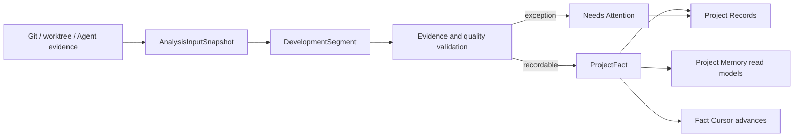
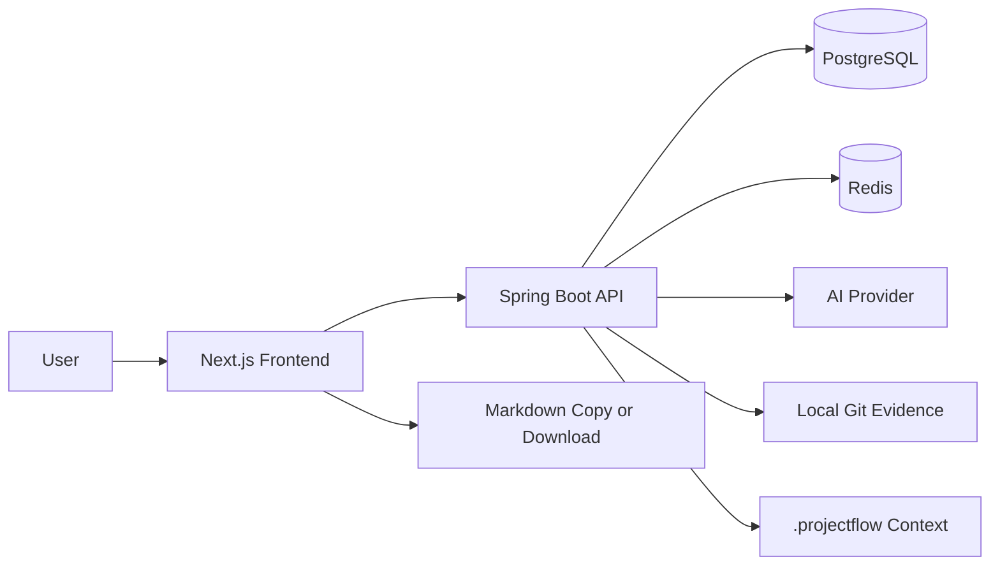
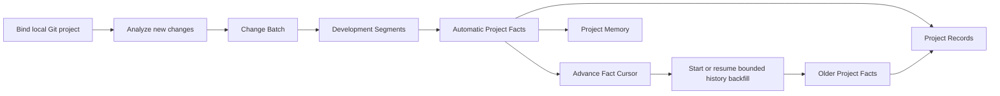
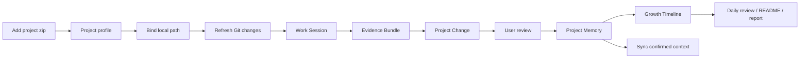
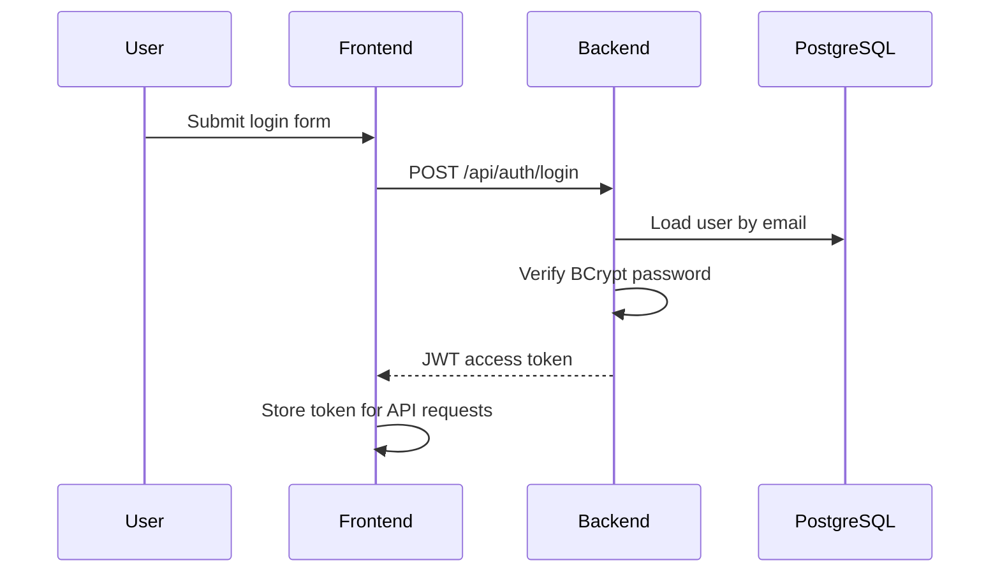
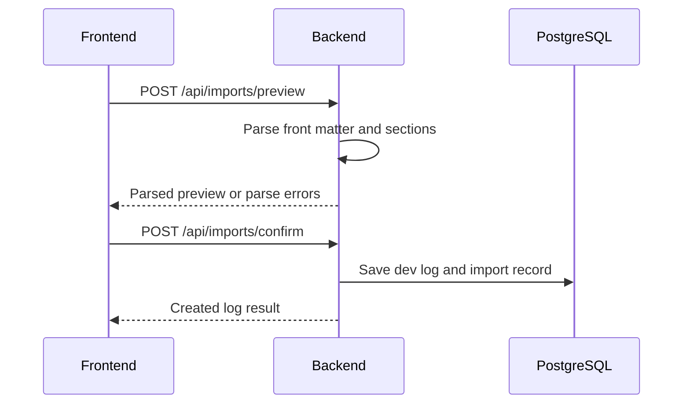
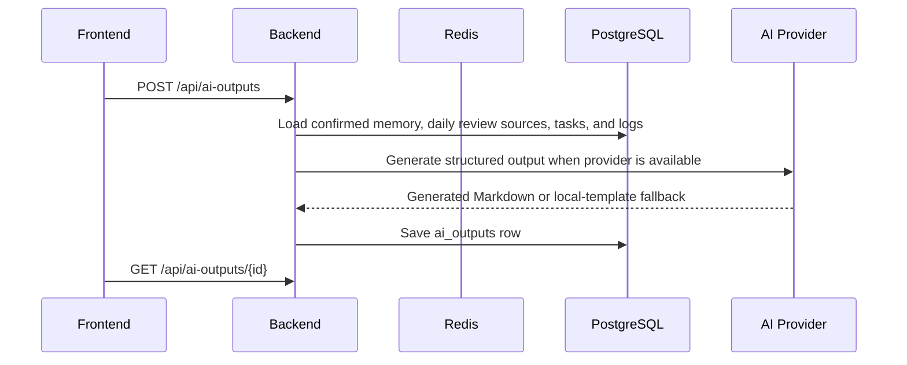

# Architecture

## V3.8.5 human-readable history closure

RC2 narrows the model boundary to wording only. `ProjectHistoryReconstructionService` constructs all identity, role, membership, lifecycle and Evidence relations before the model call; `ProjectHistoryModelOutputContract` rejects engineering-owned fields. `ProjectHistoryCorrectionService.CorrectedHistory` is the single presentation source for Frontend, Gateway, Agent, Hermes and Obsidian, with `presentationRevision` as the consistency token.

V3.8.5 keeps the V3.8.0 source-event and snapshot boundaries and adds a presentation pipeline inside the replaceable history read model: Raw Event → Technical Atom → Primary/Supporting Change → Story → Thread → Chapter. Deterministic code owns membership, chronology, transitions, Evidence and rewrite state; bounded model windows can only improve validated wording and presentation roles.

Window identities, source fingerprints, strategy/Prompt versions and presentation correction revisions form the cache identity. `ProjectHistoryWindowCheckpoint` retains safe diagnostics and validated results so completed windows can be reused and failed, cancelled, skipped or unprocessed windows remain visible. `ProjectHistoryCorrectionService` applies `USER_DECLARED_PRESENTATION` overlays at read time without writing ProjectFact, events or Evidence.

Gateway, Agent Context Package, Hermes, the frontend history preview and Obsidian all consume the corrected presentation mapper. Obsidian CORE is intentionally bounded to overview, history index, readable chapters, pinned/corrected stories and selected threads; full Story/Thread/audit output is opt-in.

## V3.8.0 project-history reconstruction

V3.8.0 adds one source-event inventory and one replaceable history snapshot without changing ProjectFact authority.

The write path is explicit refresh only: `PROJECT_HISTORY_REFRESH` job → bounded `ProjectHistorySourceCollector` → event upsert/rewrite reconciliation → deterministic story/thread/chapter reconstruction → optional one-call wording synthesis → engineering validation → atomic snapshot persistence. Git, filesystem, document, ProjectFact, Agent Result and optional GitHub envelopes retain separate source, authority and epistemic metadata.

`ProjectHistoryReconstructionService` owns membership, chronology, transition and Evidence. `ProjectHistoryPromptBuilder` packs complete JSON for at most 40 stories and 500 source events; `PROJECT_HISTORY_SYNTHESIS` can only return allow-listed story/chapter IDs and wording fields. Unknown IDs, changed chapter membership, ineligible reason Evidence, extra fields and milestone/maturity/success claims are rejected. Model failure keeps deterministic output; refresh failure keeps the prior successful snapshot.

The read path is `ProjectHistoryReadService` only. Controller, Project Memory Gateway, Hermes, Obsidian and the developer preview read persisted rows/JSON and never trigger source collection or a model. `ProjectHistoryEvent` rows remain pageable even when a snapshot is stale. Git rewrite sets removed rows to STALE or INVALIDATED rather than deleting them.

The presentation hierarchy is Overview → Dynamic Chapter → Change Story → Evolution Thread → Raw Event → Evidence. Capability and fixed Timeline remain compatibility or optional views rather than the universal hierarchy.

## V3.7.5 product-constitution and Agent-context boundary

`docs/projectflow-v3.7.5-product-constitution.md` is the single authoritative product contract. `ProjectFactEpistemicStatus` carries seven states across entities, DTOs, prompts and consumers. Only project-bound `OBSERVED` and independently checked `VERIFIED` claims may enter the strong-fact path; declarations, model inferences, conflicts, unknowns and Agent process evidence retain their own authority.

`ProjectUnderstandingPromptBuilder` is still the only production/Eval semantic boundary. Prompt contract v3, Semantic Scout v13 and Final Synthesis v7 require a complete Evidence Ledger for small source sets, one REQUEST/SKIP decision for every objectively eligible capability, required Agent-result reads for applicable process-evidence dimensions, known Evidence IDs only and bounded profile claims. Missing ledger or capability decisions are surfaced through semantic-contract diagnostics and `FAILED_DEGRADED`; Provider adapters cannot relax the contract.

`ModelRequestPolicy` treats reasoning time and Token use as process diagnostics, not quality defects. A reasoning-capable request uses the configured Provider output ceiling from its first attempt; explicitly supported Responses and Chat reasoning controls remain `high` for connection, semantic and recovery requests. Provider timeout, cancellation, heartbeat and bounded retry remain loose safety controls and never authorize silent Evidence or reasoning reduction.

`ProjectAgentHistoryService` now builds Context Package v2 from persisted project state without a model call. Task, scope, revision preference, Evidence depth and size budget drive deterministic ranking; the response preserves ranges, source revision/currentness, conflicts, unknowns, limitations, unread scope and a stable package revision. `ProjectAgentCandidateService` accepts candidate-only Agent work results, safely re-reads changed project files and binds hashes while keeping commands, tests and completion claims as process evidence.

`ProjectAgentRevalidationService` exposes five bounded local actions: verify a Fact, refresh Evidence, re-read a range, validate currentness and resolve a package against the latest revision. It uses fixed Git commands and project-contained reads, never runs project understanding and never mutates `ProjectFact`. Timeline summaries are explicitly `INFERRED` and `NON_AUTHORITATIVE`; V3.8 phase, maturity, importance and milestone authority remain out of scope. V3.7.5 adds no schema and no third-party dependency.

## V3.7.4 strong-fact, content-map and shared-history boundary

`StrongFactPromotionGuard` is the write-side trust boundary. Only `OBSERVED` or `VERIFIED` claims with same-project allow-listed Evidence can enter recorded ProjectFact state. Declaration, inference, conflict, unknown and Agent process evidence remain explicit non-strong states. Model consensus has no promotion authority; historical reasons, deprecation and technical debt require their own evidence classes.

`LargeFileContentService` uses Java 17 NIO streaming to create a bounded lexical Content Map: encoding/binary signal, source hash, line/byte bounds, headings/symbol/marker anchors, representative head/middle/tail ranges, partial limitations and unread ranges. It is not a parser or fact source. `ProjectEvidenceDiscoveryService` and the existing bounded capability provider reuse it; SCIP remains the precise code-relation provider.

`ProjectAgentHistoryService` exposes owned project catalog/search, evidence lookup, status-partitioned knowledge and a versioned bounded Context Package. `ProjectAgentCandidateService` is a separate candidate-write path that rejects strong statuses. REST and Hermes are delivery adapters over the same project-isolated semantics; GET paths do not run models or mutate facts.

Production and Eval share Strong Fact contract v2, Scout v11 and Final v6. OpenAI Responses and Chat Completions remain transport adapters under one Model Gateway; no second fact standard, ranking layer or default dual-model call is introduced.

## V3.7.3 long-running and prompt-intelligence boundary

`AnalysisTimePolicy` separates connection timeout, Provider request timeout, overall analysis deadline, bounded retry, cancellation/heartbeat and quality mode. AUTO/UNLIMITED bind no overall deadline; FINITE binds the explicit value. `ModelGatewayService` polls cancellation and heartbeat around official SDK calls, owns one transport retry, and keeps SDK retries disabled.

`ProjectUnderstandingPromptBuilder` is shared by production Scout, production Final Synthesis and direct Eval. It accepts only bounded Evidence context, allowed Evidence IDs, objective eligible capabilities/views and validated Tool Evidence; Ground Truth is structurally outside the input. Contract v1 uses Scout v10 and Final v5. The Scout context keeps every selected source ID and short summary, but only a category-diverse subset carries a bounded sample; structure projections are similarly deduplicated across kind and top-level module before complete-JSON packing. Manifest, document, Git-history and Tag-anchor gaps are independent model decisions rather than a first-tool-wins menu.

`AnalysisToolRegistry` and `AnalysisViewRegistry` decide only objective eligibility. Discovery emits `UNKNOWN` semantic importance for engineering candidates. The model decides semantic role, importance, information gaps, deep-read intent, applicable views and conflict/currentness; engineering code validates references and availability before execution or persistence.

The existing chain remains `Discover → Scout → Plan → Execute → Validate → conditional Final Synthesis → Dynamic Profile`. No database schema, new dependency, second model client, per-file/per-commit model loop, Provider manager or internal-metric UI is introduced.

## V3.7 universal evidence intelligence boundary

An explicit `PROJECT_UNDERSTANDING_REFRESH` job now follows:

`Repository Intake → Evidence Discovery → Structure Index → Historical Coverage → Semantic Scout → Capability-validated Plan → Execute → Validate → conditional Final Synthesis → Dynamic Profile → persisted read model`.

`ProjectEvidenceDiscoveryService` reuses the bounded V3.5 inventory and adds relative, typed source candidates plus redacted UTF-8 samples. It does not become a parser or content database. `SemanticScoutService` reuses the existing `PROJECT_UNDERSTANDING_SNAPSHOT` Model Gateway task for the first bounded Scout/profile response. V3.7.1 may reuse the same gateway task once more only after executed tools produce new high-value evidence; there is no second client or per-file model loop. Unknown evidence IDs are filtered before output.

`AdaptiveAnalysisPlanner` owns deterministic guardrails and combines them with bounded Scout suggestions. `AnalysisToolRegistry` is the allow-list between model intent and engineering providers; the model never constructs a shell command. Existing filesystem/manifest, SCIP consumer, Git CLI, Agent result and document-reader boundaries remain the implementations.

`DynamicProjectProfileSynthesizer` emits only applicable sections. `HistoricalCoverageService` uses bounded local Git metadata and existing ProjectFact commit references, then selects current-state-only, early-project, milestone-window or clustered-long-history strategies. It does not write Facts, Timeline, Capability or Evolution.

The V3.7 fields live in the replaceable `snapshot_json`, so no migration is required. V3.6 fixed sections remain readable compatibility projections and the next explicit refresh rebuilds the V3.7 profile. All GET endpoints remain persisted reads.

## V3.6 deep structural intelligence boundary

`CompositeProjectStructureIndexer` is the production `ProjectStructureIndexer` SPI. It always builds a bounded `MANIFEST_FILESYSTEM` fallback, then optionally consumes a safe project-local `index.scip` through Sourcegraph's official protobuf. SCIP definition/reference occurrences form a code-relation graph; JGraphT supplies PageRank important-node scoring and Label Propagation clustering. Missing, invalid, oversized, or truncated SCIP input degrades coverage and diagnostics without breaking current understanding.

Structure Index V2 is rebuildable intelligence, not a fact source. Deterministic code owns provider parsing, symbol/reference relations, graph membership, coverage, budgets, and the evidence allow-list. The existing Model Gateway receives only a compact summary of important nodes, functional areas, relative paths, and evidence IDs for user-readable semantic synthesis. There is no per-file model loop.

The minimum `ProjectEvolutionBridgeService` runs only during an explicit changed refresh. It joins an existing Project Fact to a real Git commit and parent, a bounded `git diff-tree` file set, and a current structural area. Its rows are idempotent derived records; they never mutate Facts, Timeline, Capability, or prior Capability Evolution. GET endpoints remain database-only.

Tree-sitter, language-specific SCIP index production, Desktop shells, watchers, daemons, installers, and automatic updates remain outside the V3.6 runtime boundary.

## V3.4.1 automatic timeline boundary

`ProjectFact` remains the factual source of truth. `ProjectTimelineService` is a database read model for deterministic day/ISO-week/month/lifecycle statistics; `ProjectTimelineSummaryService` maintains replaceable summaries and period-local themes through the existing persistent job executor and ModelGateway. Fact after-commit events mark scopes dirty, GET requests never invoke a model, history backfill defers generation until completion, and a failed refresh preserves the previous successful content. See `docs/project-timeline.md`.

## System Overview

ProjectFlow uses a separated frontend and backend architecture. The V3.4.1 product spine is a local-first project memory system that turns real Git, worktree, and Agent evidence into durable Project Facts and a traceable automatic Timeline without routine manual confirmation.

## V3.4.0 automatic fact memory boundary

The proven scan front half remains: `PendingChangeScanService` prepares an incremental range, evidence readers build an `AnalysisInputSnapshot`, and `DevelopmentSegmentationService` plus optional model enrichment produce `DevelopmentSegment` records. The persistence back half changes: validated segments enter fact ingestion, produce idempotent `ProjectFact` rows, update batch fact statistics, and advance `ProjectFactCursor` only after successful persistence.



`DevelopmentSegment` belongs to one analysis batch and retains model/fallback diagnostics. `ProjectFact` is the stable long-term record of what happened. Facts are append-oriented, are not merged by title similarity, and are not replaced by later timeline or capability generation. Evidence conflicts, missing evidence, incomplete boundaries, and unsafe duplicates become `NEEDS_ATTENTION`; they never block other facts or the next incremental range.

Historical reconstruction uses the existing durable-job reliability infrastructure but a separate history state/checkpoint from the incremental Fact Cursor. It processes bounded commit chunks oldest-first, skips already covered commits, preserves completed chunks on cancellation, and resumes from persisted state. It never sends the full repository history to one model request.

`ProjectChange`, `SedimentAction`, `ProjectSediment`, `ProjectReviewCursor`, and the legacy `ProjectMemory` profile row remain compatibility boundaries. New normal scans do not create the manual sediment suggestion queue. Complete timeline, lifecycle capability map, Hermes sync, and Obsidian sync are future fact consumers, not V3.4.0 architecture components.

## V3.3.8.1 dashboard read boundary

The database is the source of truth for analysis jobs, change batches, development segments, Project Facts, fact cursors, history state, and legacy compatibility records. A project-scoped sessionStorage snapshot may render immediately, but the lightweight `dashboard-bootstrap` read model always calibrates it from persisted state. Bootstrap performs only latest/count/bounded projection reads; Git, GitHub CLI, model calls, filesystem scans, history reconstruction, and long analysis remain outside this boundary. Secondary reads cannot clear the core scan result on failure.

## V3.3.8 model reliability boundary

`ModelTaskType` is the model-entry registry. `ModelCapabilityRegistry` describes Provider/model features, `ModelRequestPolicy` calculates task-aware parameters, `ModelGatewayService` owns HTTP/retry/diagnostics, and `ModelOutputAdapter` owns balanced candidate extraction and target-aware normalization. Business services own prompts and evidence validation only.

Provider testing also uses the gateway. This prevents Settings, project analysis, file analysis, change scanning and capability flows from drifting into different parameter or retry rules.

## V3.3.7 Job Execution Boundary

All job entry points converge on one project-locked active lookup. “Retry completed history” is separate from active uniqueness: a retry cannot force a second equivalent active job. Retry lineage is persisted for audit without exposing request bodies or model responses.

HTTP creation requests only validate ownership, lock the project row, reuse or persist a job, and submit its ID to the bounded executor. External Git, GitHub and model waits run without method-level database transactions. Each stage reloads cancellation and budget state; formal results are persisted only after a final checkpoint. Queue saturation becomes REJECTED rather than a model failure.

The restart listener requeues untouched QUEUED jobs. RUNNING work before model dispatch becomes RETRYABLE; work at or beyond a model stage becomes INTERRUPTED because automatic replay could duplicate billing. Completed and confirmed records are never deleted by cancellation or recovery.

## V3.3.6 legacy batch review and transaction boundaries

The V3.3.x batch review remains readable for old records and links. Its formal suggestions, local drafts, actions, and confirmed sediments are compatibility data; they do not define V3.4.0 batch completion or Fact Cursor advancement.

Confirmed `ProjectSediment` records source batch IDs, affected files, source/quality labels, and capability-analysis state. Capability analysis snapshots sediment IDs, performs the model call outside a transaction, atomically replaces only unconfirmed cards, and marks sediments analyzed only after successful persistence.

Git commands, GitHub inspection, Agent-result file scans, project/file model analysis, capability interpretation, and capability-card model calls run outside method-level database transactions. Repository reads and writes remain short transactions; progress stages use independent transactions.

## V3.3.5 Reliability Flow

Structured model calls pass through one gateway that records transport success, content presence, finish reason, usage, effective parameters, timeout, latency, truncation, JSON repair, and compact retry. Suspected truncation receives one smaller retry; if a truncated root array contains complete objects, only those complete objects may continue with a warning. Development-segment evidence and capability evidence are restored by the backend from S-number sources.

Display sanitization removes unsafe/noisy evidence markers but does not shorten persisted content. List pages use CSS preview clamps, while change, sediment, capability, and evidence details render the complete normalized text. Legacy ellipsis-ended content is treated as unrecoverable source loss and is marked for re-analysis.

Capability analysis uses the existing durable job as its batch record. Cards store `analysis_job_id`; failed jobs keep diagnostics and an acknowledgement flag, while successful replacement remains atomic and never deletes confirmed cards. Provider selection is explicit: only the unique default Provider is eligible for new model tasks.



## Components

| Component | Responsibility |
| --- | --- |
| Next.js frontend | App shell, dashboard flow state, project profile, change review, daily review, output display |
| Spring Boot backend | Auth, ownership checks, import analysis, work-session scanning, evidence lifecycle, AI orchestration, persistence |
| PostgreSQL | Source of truth for users, projects, batches, segments, facts, cursors, history state, legacy records, and outputs |
| Redis | AI task state, project statistics cache, rate limits, future import locks |
| AI provider | OpenAI-compatible Provider through ModelGateway; fixed compatible services are test infrastructure only |

## Frontend Architecture

The frontend uses Next.js App Router with a `src/` directory.

Current route groups:

```text
frontend/src/app/
+-- login/
+-- register/
+-- dashboard/
+-- projects/
+-- projects/[projectId]/
+-- projects/[projectId]/files/
+-- project-analysis-records/[recordId]/
+-- project-changes/[changeId]/
+-- sediment-review/
+-- sediment-review/[batchId]/
+-- project-intelligence/
+-- project-intelligence/[section]/
+-- project-intelligence/[section]/[itemId]/
+-- tasks/
+-- dev-logs/
+-- dev-logs/[section]/
+-- dev-logs/[section]/[itemId]/
+-- ai-review/
+-- ai-review/[section]/
+-- ai-review/[section]/[itemId]/
+-- work-sessions/[sessionId]/
+-- imports/
+-- settings/
`-- page.tsx
```

Frontend layers:

| Layer | Purpose |
| --- | --- |
| `app/` | Routes and layouts |
| `components/` | Reusable UI components |
| `features/` | Domain components where a page grows beyond route-level composition |
| `lib/api.ts` | Typed API client and request helpers |
| `lib/auth/` | Auth token handling and route guards |
| `lib/project-insights.ts` | Project/file insight classification rules |
| `components/ui/` | Shared cards, badges, toasts, project context bar, and layout primitives |

## Backend Architecture

The backend will use conventional Spring Boot layering:

```text
backend/src/main/java/com/projectflow/
+-- ProjectFlowApplication.java
+-- config/
+-- controller/
+-- dto/
+-- entity/
+-- repository/
+-- security/
+-- service/
`-- support/
```

| Layer | Responsibility |
| --- | --- |
| Controller | HTTP endpoints and request validation |
| Service | Business rules, ownership checks, workflow transitions |
| Repository | JPA persistence |
| Entity | Database mapping |
| DTO | API request and response models |
| Security | JWT, password hashing, authenticated user context |
| Support | Shared error responses, parser utilities, AI provider contracts |

Recent service/controller split:

| Area | Primary classes |
| --- | --- |
| Project import and legacy suggestions | `ProjectIntelligenceController`, `ProjectIntelligenceService` |
| Project materials | `ProjectMaterialController`, `ProjectMaterialService` |
| Project analysis jobs and records | `ProjectAnalysisController`, `ProjectAnalysisService`, `ProjectAnalysisJobService`, `ProjectAnalysisRecordService` |
| Project fact memory | `ProjectFactIngestionService`, `ProjectFactService`, `ProjectFactController`, history-state/backfill coordination |
| Legacy project memory and fact sources | `ProjectMemoryController`, `ProjectMemoryService` |
| Structured change review | `ProjectChangeController`, `ProjectChangeReviewService` |
| Zip scanning | `ProjectZipScanService` |
| Model calls and fallback | `ModelGatewayService` |
| Work sessions and evidence | `WorkSessionScanController`, `WorkSessionScanService`, `EvidenceBundleService`, `EvidenceDraftChangeService` |

## Key Flows

### V3.4 automatic fact and history flow



Rules:

- Fact persistence and incremental cursor advancement share one success boundary.
- `NEEDS_ATTENTION` is a fact-quality state, not a blocking approval queue.
- A reusable batch may idempotently fill missing facts before returning.
- History coverage and incremental coverage are independent; history work cannot move the normal cursor backward.
- Read APIs use ownership checks, pagination and aggregate/projection queries rather than loading all facts.

### V3.2 evidence-to-growth compatibility flow



Rules:

- Zip import creates the initial profile and file structure; it is not the daily change tracker.
- Local project path is required before Git evidence, agent result scanning, and context sync.
- Evidence Bundle is objective evidence, not a stable V3.4 ProjectFact.
- Project Change is the editable review object.
- Existing accepted changes and user-confirmed memory remain compatibility sources; later fact-native outputs will consume stable ProjectFact read models.
- The dashboard must expose the next action without requiring documentation.

### Authentication



### Markdown Import



### AI Output Generation



## Security Baseline

- Passwords are stored only as BCrypt hashes.
- JWT secret must come from environment variables.
- Every project-owned resource is filtered by authenticated user ownership.
- AI API keys remain backend-only. Environment injection is preferred for automation; local Provider configuration currently stores keys in the local application database for compatibility and never returns them through DTOs.
- Real `.env` files are ignored by Git.
- Parse errors and AI errors return safe messages without leaking secrets.

## V3.7.2 Quality and Integration Boundary

The internal evaluation harness is test-only code under `backend/src/test`. Its 18-case ground truth, observations, metric calculations and JSON/Markdown writer have no controller, entity, repository or frontend route. Default artifacts live under Maven `target`; committed reports contain only aggregate, scoped results.

Semantic Scout remains `PROJECT_UNDERSTANDING_SNAPSHOT`. Final Synthesis is now the separately registered `PROJECT_UNDERSTANDING_FINAL_SYNTHESIS` task because its contract contains only `dynamicProfile` and `unknowns`; this avoids schema-repair calls caused by reusing the Scout schema while retaining one Model Gateway and the same 0/1/2 logical-stage ceiling.

`HighValueEvidenceGate` replaces the V3.7.1 “any tool prompt exists” shortcut. It rejects missing, short, duplicate, clean-worktree metadata and unrecognized semantic output, and accepts only validated substantive deep content, history anchors, changed-worktree detail or conflict/currentness evidence. `AnalysisExecutionResponse.secondStageDecision` exposes the deterministic decision without exposing eval scores.

If the conditional Final Synthesis call fails, `ProjectUnderstandingService` retains the Stage 1 root, merged Source Map, validated Tool Evidence, current Dynamic Profile and bounded diagnostics. The snapshot remains `CURRENT` with `finalSynthesisStatus=FAILED_DEGRADED`; failures before Stage 1 still use the prior stale/deterministic behavior.

Analysis execution cache identity now hashes source/content/structure revisions, canonical capabilities, deep-read targets, Provider versions, execution and semantic budgets, strategy version, and relevant Source Map signatures. There is still no persistent tool-result cache in V3.7.2.

Three narrow contracts define future integrations:

- Evidence Source Adapter normalizes bounded external material into `ExternalEvidenceEnvelope`.
- Intelligence Provider Adapter consumes normalized envelopes and returns evidence-linked interpretation without owning facts.
- Projection Adapter writes/exports an existing ProjectFlow view without becoming a source of truth.

Every external envelope is project-bound, source-revisioned, relative-locator-only, redacted and `rawPayloadStored=false`. Validation rejects unsafe locators, missing bindings and duplicates. No concrete external product PoC is shipped because the contracts and validator prove the boundary without adding network, auth or storage scope.

## V3.7.1 Adaptive Execution Boundary

The explicit refresh job owns the only executable understanding path:

1. Repository Intake and Evidence Discovery collect bounded metadata and safe samples.
2. Semantic Scout receives packed evidence IDs and proposes semantic roles, dimensions and capability names.
3. Adaptive Analysis Planner validates those names through `AnalysisToolRegistry`.
4. `AnalysisExecutionCoordinator` reuses FILESYSTEM/SCIP output and delegates executable capabilities to `AnalysisCapabilityProvider`.
5. Providers use fixed command arrays, safe relative paths, allow-listed evidence IDs, item/character/time budgets and cancellation checks.
6. Produced Tool Result evidence is redacted and reference-validated before it joins the Source Map.
7. `FinalProfileSynthesisService` may issue one second Model Gateway request only when the deterministic high-value evidence gate triggers.

GET understanding, structure and evolution endpoints remain persistence-only reads. Execution output is replaceable snapshot data and never becomes ProjectFact, Timeline, Capability or Evolution truth.

`BudgetAwareContextPacker` builds the model input as a JSON tree under category budgets and a global character ceiling. It drops or truncates complete tree items before final serialization, verifies the final JSON, and records selected/dropped counts and reasons. It does not substring serialized JSON.

Inspection and sample caches are process-local, root-scoped and keyed by bounded file metadata signatures plus relevant scanner configuration. Cache loss only causes a safe rebuild. Cache content is not a new fact source and sensitive paths never enter content caches.

Historical Coverage is a derived weighted view over seven independent dimensions: Git metadata, ProjectFact linkage, Tag anchors, historical documents, Agent evidence, structural snapshots and optional remote collaboration. Per-period confidence and sampling limits remain visible.

## V3.4.2 fact-native capability layer

The durable flow is ProjectFact truth → Timeline temporal read model → ProjectCapability long-lived derived map. Capability bootstrap and incremental refresh reuse the persistent job executor and ModelGateway, call models outside fact transactions, validate exact source-fact coverage, then atomically apply stable capabilities, immutable evolutions, normalized fact relations and coverage. GET endpoints are read-only. Source fingerprints coalesce duplicate work; history backfill defers map generation until completion; a failed refresh retains the last successful map. Legacy capability cards remain a separate compatibility boundary.

## V3.4.3 Project Memory Gateway and Hermes

Project Memory Gateway is an additive read-only business layer over Facts, Timeline, Capabilities and Evolutions. It normalizes snapshot, occurrence-time recent changes, cross-layer search, timeline, capability/evolution, fact trace, budgeted brief, portfolio, Evidence, knowledge and Context Package semantics while retaining explicit SOURCE versus DERIVED labels. The local stdio MCP adapter maps thirteen narrow tools to this Gateway. Neither the adapter nor GET endpoints invoke models or write project memory. Remote MCP remains a separate secured boundary.

## V3.4.4 Obsidian projection boundary

The repository-local projection CLI is a second Gateway consumer beside Hermes. It builds curated Markdown in a configured Vault managed root, never queries repositories directly, invokes a model, or writes ProjectFlow state. CORE keeps file growth proportional to months and capabilities rather than facts. Stable metadata and a recoverable manifest form the incremental control plane; managed blocks, conflicts, path containment, atomic replacement and non-destructive redirects protect user content. No frontend, watcher, persistent sync job or operating-system integration is added.
