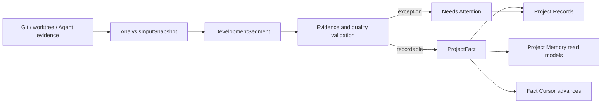
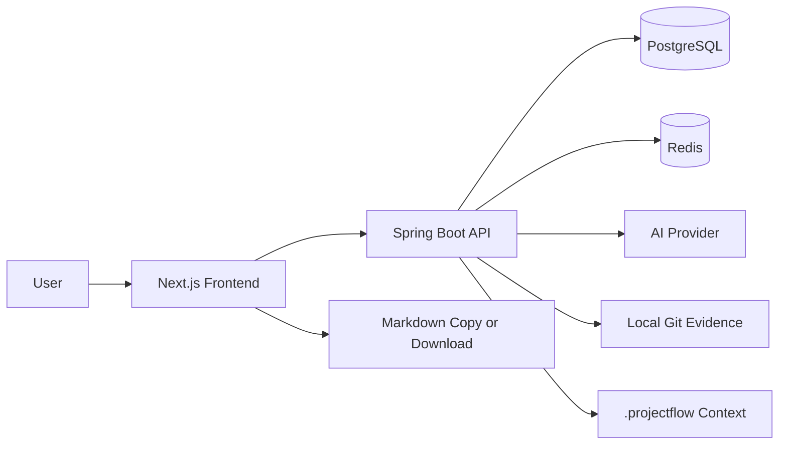
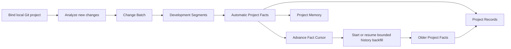
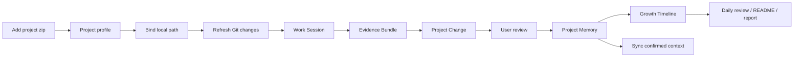
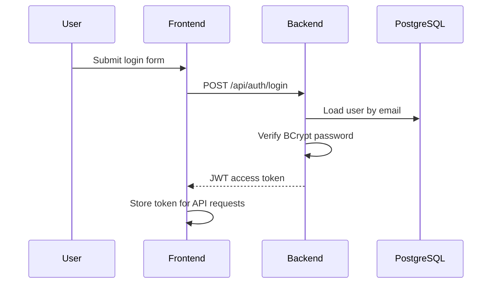
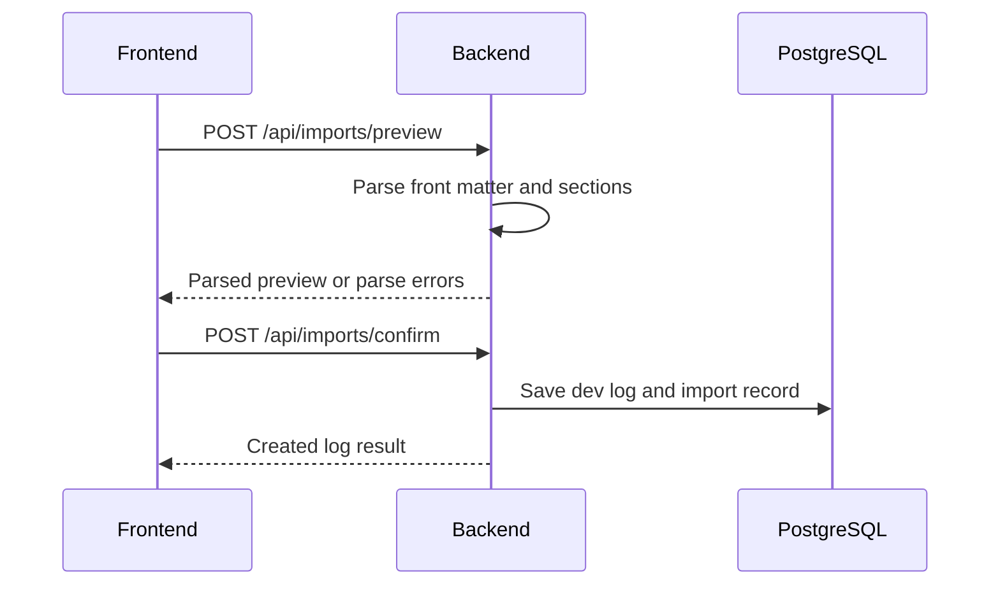
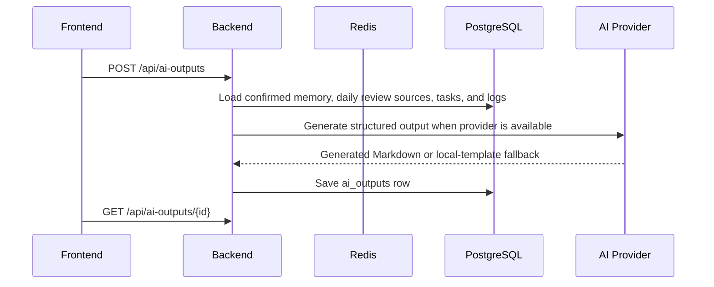

# Architecture

## System Overview

ProjectFlow uses a separated frontend and backend architecture. The V3.4.0 product spine is a local-first project memory system that turns real Git, worktree, and Agent evidence into durable Project Facts without routine manual confirmation.

## V3.4.0 automatic fact memory boundary

The proven scan front half remains: `PendingChangeScanService` prepares an incremental range, evidence readers build an `AnalysisInputSnapshot`, and `DevelopmentSegmentationService` plus optional model enrichment produce `DevelopmentSegment` records. The persistence back half changes: validated segments enter fact ingestion, produce idempotent `ProjectFact` rows, update batch fact statistics, and advance `ProjectFactCursor` only after successful persistence.



`DevelopmentSegment` belongs to one analysis batch and retains model/fallback diagnostics. `ProjectFact` is the stable long-term record of what happened. Facts are append-oriented, are not merged by title similarity, and are not replaced by later timeline or capability generation. Evidence conflicts, missing evidence, incomplete boundaries, and unsafe duplicates become `NEEDS_ATTENTION`; they never block other facts or the next incremental range.

Historical reconstruction uses the existing durable-job reliability infrastructure but a separate history state/checkpoint from the incremental Fact Cursor. It processes bounded commit chunks oldest-first, skips already covered commits, preserves completed chunks on cancellation, and resumes from persisted state. It never sends the full repository history to one model request.

`ProjectChange`, `SedimentAction`, `ProjectSediment`, `ProjectReviewCursor`, and the legacy `ProjectMemory` profile row remain compatibility boundaries. New normal scans do not create the manual sediment suggestion queue. Complete timeline, lifecycle capability map, Hermes sync, and Obsidian sync are future fact consumers, not V3.4.0 architecture components.

## V3.3.8.1 dashboard read boundary

The database is the source of truth for analysis jobs, change batches, development segments, Project Facts, fact cursors, history state, and legacy compatibility records. A project-scoped sessionStorage snapshot may render immediately, but the lightweight `dashboard-bootstrap` read model always calibrates it from persisted state. Bootstrap performs only latest/count/bounded projection reads; Git, GitHub CLI, model calls, filesystem scans, history reconstruction, and long analysis remain outside this boundary. Secondary reads cannot clear the core scan result on failure.

## V3.3.8 model reliability boundary

`ModelTaskType` is the model-entry registry. `ModelCapabilityRegistry` describes Provider/model features, `ModelRequestPolicy` calculates task-aware parameters, `ModelGatewayService` owns HTTP/retry/diagnostics, and `ModelOutputAdapter` owns balanced candidate extraction and target-aware normalization. Business services own prompts and evidence validation only.

Provider testing also uses the gateway. This prevents Settings, project analysis, file analysis, change scanning and capability flows from drifting into different parameter or retry rules.

## V3.3.7 Job Execution Boundary

All job entry points converge on one project-locked active lookup. “Retry completed history” is separate from active uniqueness: a retry cannot force a second equivalent active job. Retry lineage is persisted for audit without exposing request bodies or model responses.

HTTP creation requests only validate ownership, lock the project row, reuse or persist a job, and submit its ID to the bounded executor. External Git, GitHub and model waits run without method-level database transactions. Each stage reloads cancellation and budget state; formal results are persisted only after a final checkpoint. Queue saturation becomes REJECTED rather than a model failure.

The restart listener requeues untouched QUEUED jobs. RUNNING work before model dispatch becomes RETRYABLE; work at or beyond a model stage becomes INTERRUPTED because automatic replay could duplicate billing. Completed and confirmed records are never deleted by cancellation or recovery.

## V3.3.6 legacy batch review and transaction boundaries

The V3.3.x batch review remains readable for old records and links. Its formal suggestions, local drafts, actions, and confirmed sediments are compatibility data; they do not define V3.4.0 batch completion or Fact Cursor advancement.

Confirmed `ProjectSediment` records source batch IDs, affected files, source/quality labels, and capability-analysis state. Capability analysis snapshots sediment IDs, performs the model call outside a transaction, atomically replaces only unconfirmed cards, and marks sediments analyzed only after successful persistence.

Git commands, GitHub inspection, Agent-result file scans, project/file model analysis, capability interpretation, and capability-card model calls run outside method-level database transactions. Repository reads and writes remain short transactions; progress stages use independent transactions.

## V3.3.5 Reliability Flow

Structured model calls pass through one gateway that records transport success, content presence, finish reason, usage, effective parameters, timeout, latency, truncation, JSON repair, and compact retry. Suspected truncation receives one smaller retry; if a truncated root array contains complete objects, only those complete objects may continue with a warning. Development-segment evidence and capability evidence are restored by the backend from S-number sources.

Display sanitization removes unsafe/noisy evidence markers but does not shorten persisted content. List pages use CSS preview clamps, while change, sediment, capability, and evidence details render the complete normalized text. Legacy ellipsis-ended content is treated as unrecoverable source loss and is marked for re-analysis.

Capability analysis uses the existing durable job as its batch record. Cards store `analysis_job_id`; failed jobs keep diagnostics and an acknowledgement flag, while successful replacement remains atomic and never deletes confirmed cards. Provider selection is explicit: only the unique default Provider is eligible for new model tasks.



## Components

| Component | Responsibility |
| --- | --- |
| Next.js frontend | App shell, dashboard flow state, project profile, change review, daily review, output display |
| Spring Boot backend | Auth, ownership checks, import analysis, work-session scanning, evidence lifecycle, AI orchestration, persistence |
| PostgreSQL | Source of truth for users, projects, batches, segments, facts, cursors, history state, legacy records, and outputs |
| Redis | AI task state, project statistics cache, rate limits, future import locks |
| AI provider | OpenAI-compatible Provider through ModelGateway; fixed compatible services are test infrastructure only |

## Frontend Architecture

The frontend uses Next.js App Router with a `src/` directory.

Current route groups:

```text
frontend/src/app/
+-- login/
+-- register/
+-- dashboard/
+-- projects/
+-- projects/[projectId]/
+-- projects/[projectId]/files/
+-- project-analysis-records/[recordId]/
+-- project-changes/[changeId]/
+-- sediment-review/
+-- sediment-review/[batchId]/
+-- project-intelligence/
+-- project-intelligence/[section]/
+-- project-intelligence/[section]/[itemId]/
+-- tasks/
+-- dev-logs/
+-- dev-logs/[section]/
+-- dev-logs/[section]/[itemId]/
+-- ai-review/
+-- ai-review/[section]/
+-- ai-review/[section]/[itemId]/
+-- work-sessions/[sessionId]/
+-- imports/
+-- settings/
`-- page.tsx
```

Frontend layers:

| Layer | Purpose |
| --- | --- |
| `app/` | Routes and layouts |
| `components/` | Reusable UI components |
| `features/` | Domain components where a page grows beyond route-level composition |
| `lib/api.ts` | Typed API client and request helpers |
| `lib/auth/` | Auth token handling and route guards |
| `lib/project-insights.ts` | Project/file insight classification rules |
| `components/ui/` | Shared cards, badges, toasts, project context bar, and layout primitives |

## Backend Architecture

The backend will use conventional Spring Boot layering:

```text
backend/src/main/java/com/projectflow/
+-- ProjectFlowApplication.java
+-- config/
+-- controller/
+-- dto/
+-- entity/
+-- repository/
+-- security/
+-- service/
`-- support/
```

| Layer | Responsibility |
| --- | --- |
| Controller | HTTP endpoints and request validation |
| Service | Business rules, ownership checks, workflow transitions |
| Repository | JPA persistence |
| Entity | Database mapping |
| DTO | API request and response models |
| Security | JWT, password hashing, authenticated user context |
| Support | Shared error responses, parser utilities, AI provider contracts |

Recent service/controller split:

| Area | Primary classes |
| --- | --- |
| Project import and legacy suggestions | `ProjectIntelligenceController`, `ProjectIntelligenceService` |
| Project materials | `ProjectMaterialController`, `ProjectMaterialService` |
| Project analysis jobs and records | `ProjectAnalysisController`, `ProjectAnalysisService`, `ProjectAnalysisJobService`, `ProjectAnalysisRecordService` |
| Project fact memory | `ProjectFactIngestionService`, `ProjectFactService`, `ProjectFactController`, history-state/backfill coordination |
| Legacy project memory and fact sources | `ProjectMemoryController`, `ProjectMemoryService` |
| Structured change review | `ProjectChangeController`, `ProjectChangeReviewService` |
| Zip scanning | `ProjectZipScanService` |
| Model calls and fallback | `ModelGatewayService` |
| Work sessions and evidence | `WorkSessionScanController`, `WorkSessionScanService`, `EvidenceBundleService`, `EvidenceDraftChangeService` |

## Key Flows

### V3.4 automatic fact and history flow



Rules:

- Fact persistence and incremental cursor advancement share one success boundary.
- `NEEDS_ATTENTION` is a fact-quality state, not a blocking approval queue.
- A reusable batch may idempotently fill missing facts before returning.
- History coverage and incremental coverage are independent; history work cannot move the normal cursor backward.
- Read APIs use ownership checks, pagination and aggregate/projection queries rather than loading all facts.

### V3.2 evidence-to-growth compatibility flow



Rules:

- Zip import creates the initial profile and file structure; it is not the daily change tracker.
- Local project path is required before Git evidence, agent result scanning, and context sync.
- Evidence Bundle is objective evidence, not a stable V3.4 ProjectFact.
- Project Change is the editable review object.
- Existing accepted changes and user-confirmed memory remain compatibility sources; later fact-native outputs will consume stable ProjectFact read models.
- The dashboard must expose the next action without requiring documentation.

### Authentication



### Markdown Import



### AI Output Generation



## Security Baseline

- Passwords are stored only as BCrypt hashes.
- JWT secret must come from environment variables.
- Every project-owned resource is filtered by authenticated user ownership.
- AI API keys are backend-only environment variables.
- Real `.env` files are ignored by Git.
- Parse errors and AI errors return safe messages without leaking secrets.
