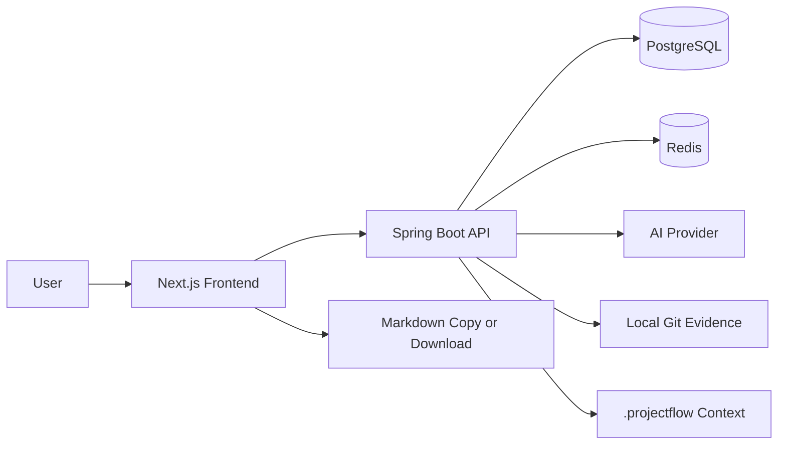
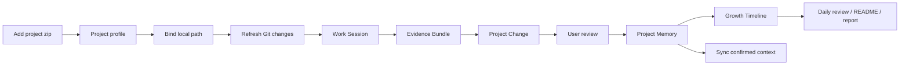
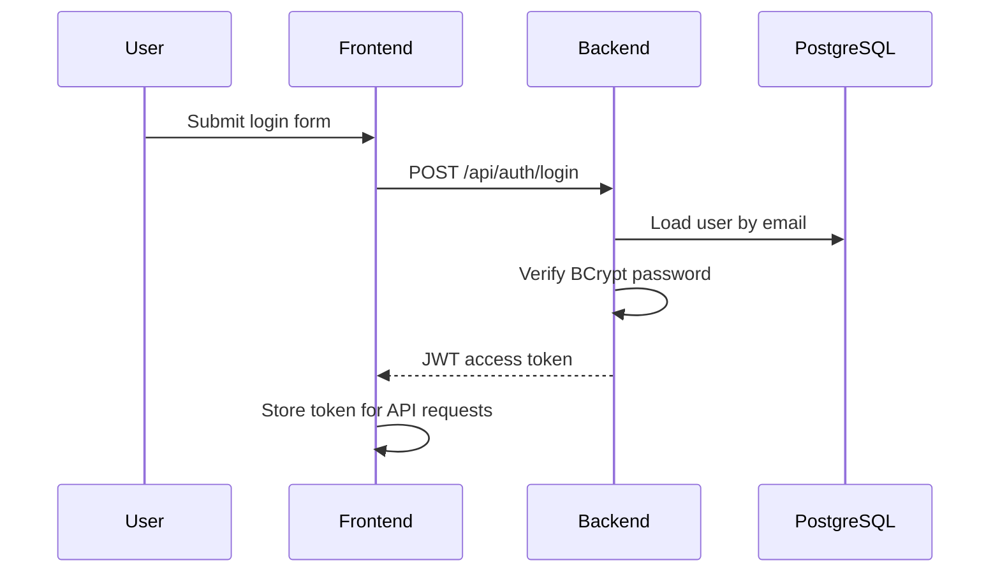
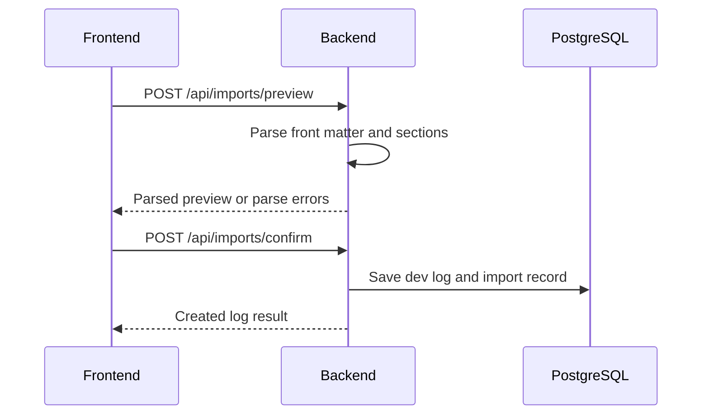
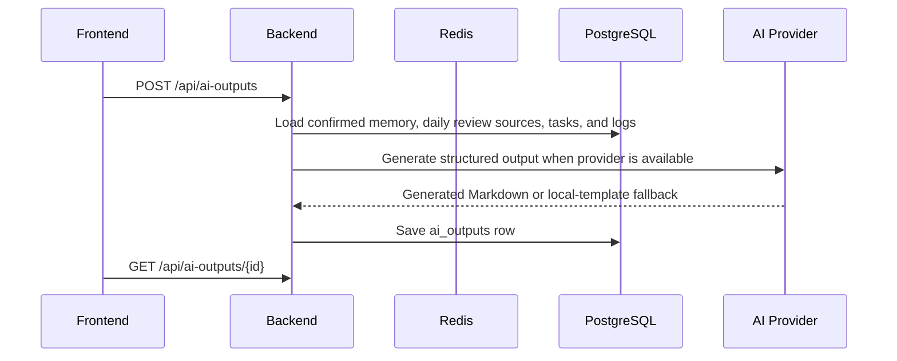

# Architecture

## System Overview

ProjectFlow uses a separated frontend and backend architecture. The current V3.3.5 product spine is a developer workbench that turns real project activity into confirmed project sediment.

## V3.3.5 Reliability Flow

Structured model calls pass through one gateway that records transport success, content presence, finish reason, usage, effective parameters, timeout, latency, truncation, JSON repair, and compact retry. Suspected truncation receives one smaller retry; if a truncated root array contains complete objects, only those complete objects may continue with a warning. Development-segment evidence and capability evidence are restored by the backend from S-number sources.

Display sanitization removes unsafe/noisy evidence markers but does not shorten persisted content. List pages use CSS preview clamps, while change, sediment, capability, and evidence details render the complete normalized text. Legacy ellipsis-ended content is treated as unrecoverable source loss and is marked for re-analysis.

Capability analysis uses the existing durable job as its batch record. Cards store `analysis_job_id`; failed jobs keep diagnostics and an acknowledgement flag, while successful replacement remains atomic and never deletes confirmed cards. Provider selection is explicit: only the unique default Provider is eligible for new model tasks.



## Components

| Component | Responsibility |
| --- | --- |
| Next.js frontend | App shell, dashboard flow state, project profile, change review, daily review, output display |
| Spring Boot backend | Auth, ownership checks, import analysis, work-session scanning, evidence lifecycle, AI orchestration, persistence |
| PostgreSQL | Source of truth for users, projects, tasks, logs, materials, changes, memory, evidence bundles, AI outputs |
| Redis | AI task state, project statistics cache, rate limits, future import locks |
| AI provider | Mock provider first; later DeepSeek or OpenAI-compatible provider |

## Frontend Architecture

The frontend uses Next.js App Router with a `src/` directory.

Current route groups:

```text
frontend/src/app/
+-- login/
+-- register/
+-- dashboard/
+-- projects/
+-- projects/[projectId]/
+-- projects/[projectId]/files/
+-- project-analysis-records/[recordId]/
+-- project-changes/[changeId]/
+-- project-intelligence/
+-- project-intelligence/[section]/
+-- project-intelligence/[section]/[itemId]/
+-- tasks/
+-- dev-logs/
+-- dev-logs/[section]/
+-- dev-logs/[section]/[itemId]/
+-- ai-review/
+-- ai-review/[section]/
+-- ai-review/[section]/[itemId]/
+-- work-sessions/[sessionId]/
+-- imports/
+-- settings/
`-- page.tsx
```

Frontend layers:

| Layer | Purpose |
| --- | --- |
| `app/` | Routes and layouts |
| `components/` | Reusable UI components |
| `features/` | Domain components where a page grows beyond route-level composition |
| `lib/api.ts` | Typed API client and request helpers |
| `lib/auth/` | Auth token handling and route guards |
| `lib/project-insights.ts` | Project/file insight classification rules |
| `components/ui/` | Shared cards, badges, toasts, project context bar, and layout primitives |

## Backend Architecture

The backend will use conventional Spring Boot layering:

```text
backend/src/main/java/com/projectflow/
+-- ProjectFlowApplication.java
+-- config/
+-- controller/
+-- dto/
+-- entity/
+-- repository/
+-- security/
+-- service/
`-- support/
```

| Layer | Responsibility |
| --- | --- |
| Controller | HTTP endpoints and request validation |
| Service | Business rules, ownership checks, workflow transitions |
| Repository | JPA persistence |
| Entity | Database mapping |
| DTO | API request and response models |
| Security | JWT, password hashing, authenticated user context |
| Support | Shared error responses, parser utilities, AI provider contracts |

Recent service/controller split:

| Area | Primary classes |
| --- | --- |
| Project import and legacy suggestions | `ProjectIntelligenceController`, `ProjectIntelligenceService` |
| Project materials | `ProjectMaterialController`, `ProjectMaterialService` |
| Project analysis jobs and records | `ProjectAnalysisController`, `ProjectAnalysisService`, `ProjectAnalysisJobService`, `ProjectAnalysisRecordService` |
| Project memory and fact sources | `ProjectMemoryController`, `ProjectMemoryService` |
| Structured change review | `ProjectChangeController`, `ProjectChangeReviewService` |
| Zip scanning | `ProjectZipScanService` |
| Model calls and fallback | `ModelGatewayService` |
| Work sessions and evidence | `WorkSessionScanController`, `WorkSessionScanService`, `EvidenceBundleService`, `EvidenceDraftChangeService` |

## Key Flows

### V3.2 Evidence To Growth Flow



Rules:

- Zip import creates the initial profile and file structure; it is not the daily change tracker.
- Local project path is required before Git evidence, agent result scanning, and context sync.
- Evidence Bundle is objective evidence, not a confirmed project fact.
- Project Change is the editable review object.
- Only accepted changes and user-confirmed memory become output sources and synced context.
- The dashboard must expose the next action without requiring documentation.

### Authentication



### Markdown Import



### AI Output Generation



## Security Baseline

- Passwords are stored only as BCrypt hashes.
- JWT secret must come from environment variables.
- Every project-owned resource is filtered by authenticated user ownership.
- AI API keys are backend-only environment variables.
- Real `.env` files are ignored by Git.
- Parse errors and AI errors return safe messages without leaking secrets.
