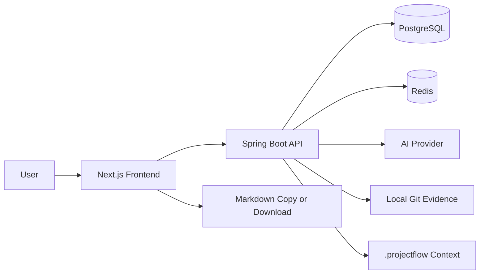
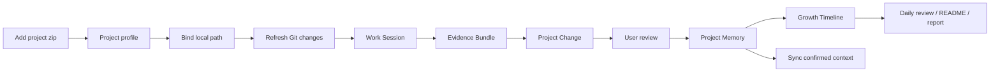
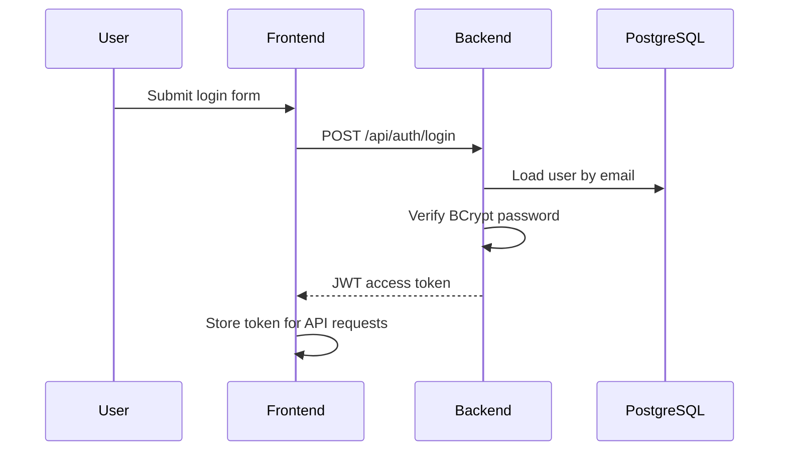
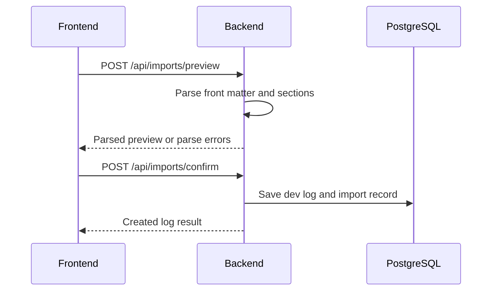
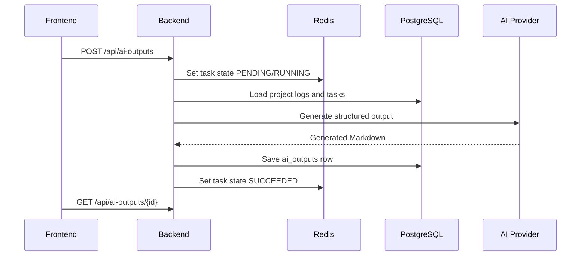

# Architecture

## System Overview

ProjectFlow uses a separated frontend and backend architecture. The current V3.2 product spine is a developer workbench that turns real project activity into confirmed project assets.



## Components

| Component | Responsibility |
| --- | --- |
| Next.js frontend | App shell, dashboard flow state, project profile, change review, daily review, output display |
| Spring Boot backend | Auth, ownership checks, import analysis, work-session scanning, evidence lifecycle, AI orchestration, persistence |
| PostgreSQL | Source of truth for users, projects, tasks, logs, materials, changes, memory, evidence bundles, AI outputs |
| Redis | AI task state, project statistics cache, rate limits, future import locks |
| AI provider | Mock provider first; later DeepSeek or OpenAI-compatible provider |

## Frontend Architecture

The frontend will use Next.js App Router with a `src/` directory.

Planned route groups:

```text
frontend/src/app/
+-- (auth)/
|   +-- login/
|   `-- register/
+-- (app)/
|   +-- dashboard/
|   +-- projects/
|   +-- tasks/
|   +-- dev-logs/
|   +-- imports/
|   +-- ai-outputs/
|   `-- settings/
`-- page.tsx
```

Planned frontend layers:

| Layer | Purpose |
| --- | --- |
| `app/` | Routes and layouts |
| `components/` | Reusable UI components |
| `features/` | Domain components for projects, tasks, logs, imports, AI outputs |
| `lib/api/` | API client and request helpers |
| `lib/auth/` | Auth token handling and route guards |
| `types/` | Shared frontend types |

## Backend Architecture

The backend will use conventional Spring Boot layering:

```text
backend/src/main/java/com/projectflow/
+-- ProjectFlowApplication.java
+-- config/
+-- controller/
+-- dto/
+-- entity/
+-- repository/
+-- security/
+-- service/
`-- support/
```

| Layer | Responsibility |
| --- | --- |
| Controller | HTTP endpoints and request validation |
| Service | Business rules, ownership checks, workflow transitions |
| Repository | JPA persistence |
| Entity | Database mapping |
| DTO | API request and response models |
| Security | JWT, password hashing, authenticated user context |
| Support | Shared error responses, parser utilities, AI provider contracts |

## Key Flows

### V3.2 Evidence To Growth Flow



Rules:

- Zip import creates the initial profile and file structure; it is not the daily change tracker.
- Local project path is required before Git evidence, agent result scanning, and context sync.
- Evidence Bundle is objective evidence, not a confirmed project fact.
- Project Change is the editable review object.
- Only accepted changes and user-confirmed memory become output sources and synced context.
- The dashboard must expose the next action without requiring documentation.

### Authentication



### Markdown Import



### AI Output Generation



## Security Baseline

- Passwords are stored only as BCrypt hashes.
- JWT secret must come from environment variables.
- Every project-owned resource is filtered by authenticated user ownership.
- AI API keys are backend-only environment variables.
- Real `.env` files are ignored by Git.
- Parse errors and AI errors return safe messages without leaking secrets.
