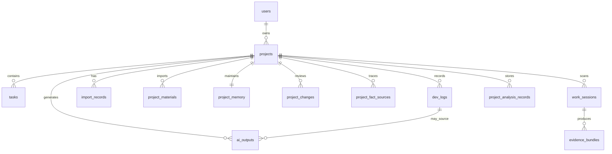

# Data Model

## V3.3.8.1 read compatibility

`ChangeBatch`, `ProjectChange`, and `DevelopmentSegment` remain business facts even when historical rows predate newer diagnostic fields. Entity/DTO reads now apply conservative null-safe values for batch model/provider/scope/GitHub/fingerprint/timing/status/timestamps, change source/quality/strength/action/evidence, and segment generation/quality/fallback/evidence/status fields. No data backfill rewrites historical values; incomplete batches are exposed as `LEGACY_INCOMPLETE` for user review.

Dashboard snapshots use schema version 2 and the key `projectflow:dashboardSnapshot:{projectId}` with project ID, capture time, latest job ID, latest batch ID, and batch update time. This browser record is disposable cache metadata, not a database entity or business source.

## V3.3.8 model diagnostics

No new model-response table is introduced. Persisted job/result diagnostics add safe parameter provenance, capability profile, retry type, Schema match, reasoning-budget signal and failure stage/code. They intentionally exclude API keys, Authorization, full prompts, raw responses and reasoning text.

## V3.3.7 analysis job reliability fields

`project_analysis_jobs` now records queued/heartbeat/cancellation timestamps, attempt and model-request counts, prompt/completion/total tokens, task request/time/token limits, input fingerprint, idempotency key, queue position, failure code, restart recovery state, retry lineage (`retried_from_job_id`, `retry_reason`), and optimistic version. Reliability fields remain nullable where safe; entity load applies conservative defaults for legacy rows. The version column uses database default `0` so a populated old table can be upgraded and flushed safely.

Statuses distinguish QUEUED, RUNNING, CANCEL_REQUESTED, CANCELLED, SUCCEEDED, SUCCEEDED_WITH_WARNINGS, FAILED, INTERRUPTED, RETRYABLE, EXPIRED and REJECTED. A status is user-visible lifecycle evidence, not only a spinner flag.

Primary IDs use UUIDs. Timestamps use UTC at the database layer and are displayed in the user's local timezone in the frontend.

## V3.3.6 compatibility fields

`project_changes` adds nullable `source_batch_id`, `content_source`, `quality_status`, and `recommendation_strength`. Old rows return legacy-safe labels and are not assigned to a new batch.

`project_sediments` adds `affected_files`, `source_batch_ids`, `content_source`, `quality_status`, `capability_status`, `last_capability_analysis_job_id`, and `last_capability_analyzed_at`. Old confirmed sediments remain intact and are treated as pending capability analysis until a successful analysis records their job.

Capability cards continue to store `analysis_job_id`; their `source_refs` now use `sediment:<uuid>` for new V3.3.6 runs. Existing `segment:<uuid>` and source-unknown cards remain readable.

All new columns are nullable or have application-level fallback values. Hibernate update mode can add them to H2 and PostgreSQL without clearing existing tables. Capability status is updated only after candidate-card persistence succeeds, so failed analysis leaves pending sediments untouched.

## V3.3.5 compatibility fields

`project_analysis_jobs` adds nullable `diagnostics_json`, `model_returned`, and `failure_acknowledged`. Existing rows remain valid and are shown as historical jobs when diagnostics are absent.

`project_capability_cards` adds nullable `analysis_job_id`. A null value means a legacy result with unknown batch provenance; it is never inferred to belong to the newest job.

`project_changes` adds nullable `suggestion_reason`, separating the recommendation explanation from the actual problem solved. Existing confirmed changes and sediments are not rewritten.

These additions are nullable or use wrapper defaults so Hibernate update mode can add them for both embedded H2 and Docker PostgreSQL without deleting existing rows. Old ellipsis-ended content is detected at response time and marked for re-analysis; migration does not fabricate missing text.

## Entity Overview

## users

| Field | Type | Notes |
| --- | --- | --- |
| id | UUID | Primary key |
| username | varchar(80) | Required |
| email | varchar(255) | Required, unique |
| password_hash | varchar(255) | BCrypt hash |
| created_at | timestamptz | Required |
| updated_at | timestamptz | Required |

## projects

| Field | Type | Notes |
| --- | --- | --- |
| id | UUID | Primary key |
| user_id | UUID | FK to users |
| name | varchar(160) | Required |
| description | text | Optional |
| status | varchar(40) | PLANNING, BUILDING, PAUSED, COMPLETED, ARCHIVED |
| tech_stack | jsonb | Array of strings |
| repo_url | varchar(500) | Optional |
| start_date | date | Optional |
| end_date | date | Optional |
| created_at | timestamptz | Required |
| updated_at | timestamptz | Required |

## tasks

| Field | Type | Notes |
| --- | --- | --- |
| id | UUID | Primary key |
| project_id | UUID | FK to projects |
| title | varchar(200) | Required |
| description | text | Optional |
| status | varchar(40) | BACKLOG, TODO, IN_PROGRESS, REVIEW, DONE |
| priority | varchar(20) | LOW, MEDIUM, HIGH |
| due_date | date | Optional |
| tags | jsonb | Array of strings |
| created_at | timestamptz | Required |
| updated_at | timestamptz | Required |

## dev_logs

| Field | Type | Notes |
| --- | --- | --- |
| id | UUID | Primary key |
| project_id | UUID | FK to projects |
| task_id | UUID | Optional FK to tasks |
| title | varchar(180) | Required |
| content | text | Required Markdown-compatible log body |
| category | varchar(40) | FEATURE, BUGFIX, REFACTOR, RESEARCH, REVIEW, DEPLOYMENT |
| log_date | date | Required |
| minutes_spent | integer | Required |
| blocked | boolean | Required risk/blocked marker |
| tags | jsonb | Array of strings |
| created_at | timestamptz | Required |
| updated_at | timestamptz | Required |

## import_records

| Field | Type | Notes |
| --- | --- | --- |
| id | UUID | Primary key |
| project_id | UUID | FK to projects |
| dev_log_id | UUID | FK to created dev log |
| title | varchar(180) | Parsed title |
| source | varchar(80) | codex, claude, gpt, markdown, imported |
| raw_markdown | text | Original pasted Markdown |
| warnings | jsonb | Parser warnings |
| created_at | timestamptz | Required |

## ai_outputs

| Field | Type | Notes |
| --- | --- | --- |
| id | UUID | Primary key |
| project_id | UUID | FK to projects |
| type | varchar(40) | WEEKLY_REPORT, PROJECT_SUMMARY, RESUME_BULLET, README_SECTION |
| title | varchar(180) | Generated output title |
| content | text | Generated Markdown |
| provider | varchar(60) | mock-provider first, real provider later |
| from_date | date | Optional source range |
| to_date | date | Optional source range |
| created_at | timestamptz | Required |
| updated_at | timestamptz | Required |

## project_materials

Imported or scanned source material used to create project understanding.

| Field | Type | Notes |
| --- | --- | --- |
| id | UUID | Primary key |
| project_id | UUID | FK to projects |
| source_type | varchar(40) | ZIP_IMPORT, AGENT_RESULT, USER_NOTE, FILE_UPLOAD, etc. |
| title | varchar(200) | Display title |
| content | text | Sanitized or summarized content |
| metadata | json/text | File paths, source hints, import summary |
| created_at | timestamptz | Required |

## project_memory

The confirmed project archive. Outputs and context sync should prefer this over unreviewed evidence.

| Field | Type | Notes |
| --- | --- | --- |
| id | UUID | Primary key |
| project_id | UUID | One memory row per project |
| project_profile | text | Confirmed project description |
| requirements | text | Confirmed requirements or business rules |
| decisions | text | Confirmed technical decisions |
| risks | text | Confirmed risks |
| completed_capabilities | text | Confirmed completed capabilities |
| in_progress_capabilities | text | Confirmed active work |
| learnings | text | Experience and reusable notes |
| outcome_material | text | Output-ready project material |
| local_project_path | text | Bound local project folder path |
| updated_at | timestamptz | Required |

## work_sessions

Detected development activity from local Git evidence.

| Field | Type | Notes |
| --- | --- | --- |
| id | UUID | Primary key |
| project_id | UUID | FK to projects |
| source_type | varchar(40) | Git/worktree/source evidence type |
| summary | text | Human-readable activity summary |
| changed_files | integer | File count |
| added_lines | integer | Added lines |
| deleted_lines | integer | Deleted lines |
| started_at | timestamptz | Optional evidence start |
| ended_at | timestamptz | Optional evidence end |
| status | varchar(40) | Candidate / reviewed lifecycle |

## evidence_bundles

Objective evidence package for a work session.

| Field | Type | Notes |
| --- | --- | --- |
| id | UUID | Primary key |
| project_id | UUID | FK to projects |
| work_session_id | UUID | FK to work_sessions |
| status | varchar(40) | READY_FOR_CHANGE, CHANGE_DRAFTED, CHANGE_ACCEPTED, ARCHIVED |
| next_action | varchar(40) | GENERATE_CHANGE, REVIEW_CHANGE, VIEW_MEMORY, NO_ACTION |
| files | text/json | Changed files |
| objective_evidence | text/json | Git and scan evidence |
| agent_claims | text/json | Optional agent-supplied claims |
| created_at | timestamptz | Required |
| updated_at | timestamptz | Required |

## project_changes

Reviewable structured change generated from evidence.

| Field | Type | Notes |
| --- | --- | --- |
| id | UUID | Primary key |
| project_id | UUID | FK to projects |
| evidence_bundle_id | UUID | Optional source bundle |
| change_type | varchar(40) | Capability, risk, decision, learning, output, etc. |
| impact | varchar(40) | Major / minor / unknown |
| status | varchar(40) | PENDING, ACCEPTED, IGNORED |
| title | varchar(200) | Review title |
| summary | text | Review summary |
| details | text | Evidence details |
| affected_files | text/json | Related files |
| accepted_at | timestamptz | Optional |
| created_at | timestamptz | Required |

## project_fact_sources

Traceability for confirmed project archive fields.

| Field | Type | Notes |
| --- | --- | --- |
| id | UUID | Primary key |
| project_id | UUID | FK to projects |
| field_name | varchar(80) | Memory field updated |
| source_type | varchar(80) | PROJECT_CHANGE, USER_EDIT, IMPORT, etc. |
| source_id | UUID | Optional source record |
| summary | text | Human-readable source summary |
| created_at | timestamptz | Required |

## project_analysis_records

Persisted project or file analysis result.

| Field | Type | Notes |
| --- | --- | --- |
| id | UUID | Primary key |
| project_id | UUID | FK to projects |
| analysis_type | varchar(40) | PROJECT or FILE |
| title | varchar(200) | Display title |
| summary | text | Analysis summary |
| content | text | Detailed analysis |
| provider | varchar(80) | Model provider or local fallback |
| created_at | timestamptz | Required |

## Indexes

| Table | Index |
| --- | --- |
| users | unique email |
| projects | user_id, status |
| tasks | project_id, status |
| dev_logs | project_id, log_date desc |
| import_records | project_id, created_at desc |
| ai_outputs | project_id, type, created_at desc |
| project_materials | project_id, created_at desc |
| project_changes | project_id, status, created_at desc |
| project_fact_sources | project_id, field_name, created_at desc |
| work_sessions | project_id, ended_at desc |
| evidence_bundles | project_id, status, updated_at desc |
| project_analysis_records | project_id, created_at desc |

## Ownership Rule

All resource access is scoped through `projects.user_id`. A user can access tasks, dev logs, import records, AI outputs, project materials, work sessions, evidence bundles, changes, memory, fact sources, or analysis records only if the parent project belongs to that user.
