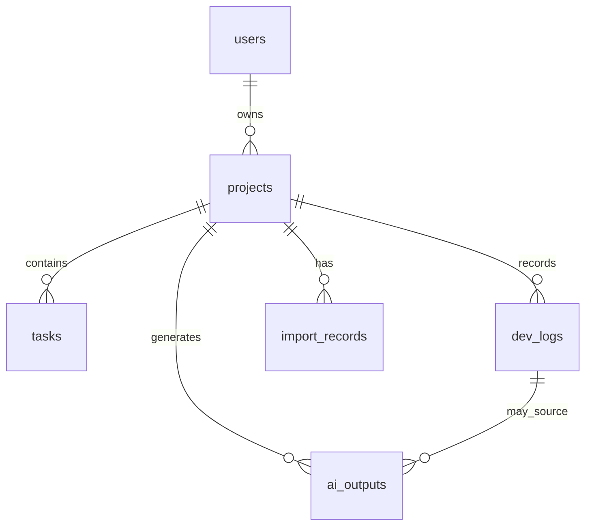

# Data Model

Primary IDs use UUIDs. Timestamps use UTC at the database layer and are displayed in the user's local timezone in the frontend.

## Entity Overview

## users

| Field | Type | Notes |
| --- | --- | --- |
| id | UUID | Primary key |
| username | varchar(80) | Required |
| email | varchar(255) | Required, unique |
| password_hash | varchar(255) | BCrypt hash |
| created_at | timestamptz | Required |
| updated_at | timestamptz | Required |

## projects

| Field | Type | Notes |
| --- | --- | --- |
| id | UUID | Primary key |
| user_id | UUID | FK to users |
| name | varchar(160) | Required |
| description | text | Optional |
| status | varchar(40) | PLANNING, BUILDING, PAUSED, COMPLETED, ARCHIVED |
| tech_stack | jsonb | Array of strings |
| repo_url | varchar(500) | Optional |
| start_date | date | Optional |
| end_date | date | Optional |
| created_at | timestamptz | Required |
| updated_at | timestamptz | Required |

## tasks

| Field | Type | Notes |
| --- | --- | --- |
| id | UUID | Primary key |
| project_id | UUID | FK to projects |
| title | varchar(200) | Required |
| description | text | Optional |
| status | varchar(40) | BACKLOG, TODO, IN_PROGRESS, REVIEW, DONE |
| priority | varchar(20) | LOW, MEDIUM, HIGH |
| due_date | date | Optional |
| tags | jsonb | Array of strings |
| created_at | timestamptz | Required |
| updated_at | timestamptz | Required |

## dev_logs

| Field | Type | Notes |
| --- | --- | --- |
| id | UUID | Primary key |
| project_id | UUID | FK to projects |
| task_id | UUID | Optional FK to tasks |
| title | varchar(180) | Required |
| content | text | Required Markdown-compatible log body |
| category | varchar(40) | FEATURE, BUGFIX, REFACTOR, RESEARCH, REVIEW, DEPLOYMENT |
| log_date | date | Required |
| minutes_spent | integer | Required |
| blocked | boolean | Required risk/blocked marker |
| tags | jsonb | Array of strings |
| created_at | timestamptz | Required |
| updated_at | timestamptz | Required |

## import_records

| Field | Type | Notes |
| --- | --- | --- |
| id | UUID | Primary key |
| project_id | UUID | FK to projects |
| dev_log_id | UUID | FK to created dev log |
| title | varchar(180) | Parsed title |
| source | varchar(80) | codex, claude, gpt, markdown, imported |
| raw_markdown | text | Original pasted Markdown |
| warnings | jsonb | Parser warnings |
| created_at | timestamptz | Required |

## ai_outputs

| Field | Type | Notes |
| --- | --- | --- |
| id | UUID | Primary key |
| project_id | UUID | FK to projects |
| type | varchar(40) | WEEKLY_REPORT, PROJECT_SUMMARY, RESUME_BULLET, README_SECTION |
| title | varchar(180) | Generated output title |
| content | text | Generated Markdown |
| provider | varchar(60) | mock-provider first, real provider later |
| from_date | date | Optional source range |
| to_date | date | Optional source range |
| created_at | timestamptz | Required |
| updated_at | timestamptz | Required |

## Indexes

| Table | Index |
| --- | --- |
| users | unique email |
| projects | user_id, status |
| tasks | project_id, status |
| dev_logs | project_id, log_date desc |
| import_records | project_id, created_at desc |
| ai_outputs | project_id, type, created_at desc |

## Ownership Rule

All resource access is scoped through `projects.user_id`. A user can access a task, dev log, import record, or AI output only if the parent project belongs to that user.
