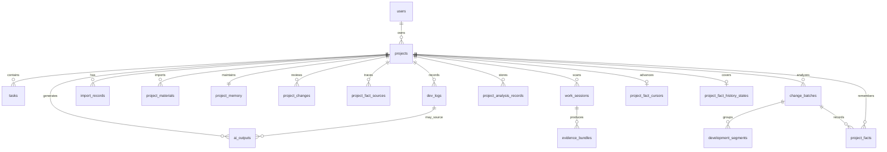

# Data Model

## V3.8.5 presentation and checkpoint additions

RC2 does not add a durable fact entity or migrate ProjectFact. `presentationRevision` is a corrected-view consistency token exposed by DTOs, not a new truth source. `HistoryEventResponse.userSummary` is derived display text; `safeSourceLabel`, source revision, paths and Evidence remain available for audit and are never overwritten.

`project_history_window_checkpoints` is a bounded, project-owned cache/checkpoint table. It stores window identity, source fingerprint, cache key, status, counts, safe diagnostics and validated presentation JSON only; it never stores Prompt, raw response, reasoning, credentials or complete source material.

`project_history_corrections` stores durable `USER_DECLARED_PRESENTATION` overlays with target IDs, actor, source/presentation revisions, declared values, status, conflict/revert relation and timestamps. Corrections are applied at read time and cannot promote a claim or mutate ProjectFact, ProjectHistoryEvent or Evidence. Snapshot JSON remains replaceable and old snapshots remain readable through compatibility defaults.

## V3.8.0 Project History

### project_history_events

One row represents one normalized source event. Stable identity is scoped by project, source type, source identity and source revision. Rows are never promoted to ProjectFact merely because they exist.

| Field group | Meaning |
| --- | --- |
| project/source identity | `project_id`, `stable_event_key`, `source_type`, `source_identity`, `source_revision`, `project_revision` |
| occurrence | `occurred_at`, `effective_at`, safe actor/scope/category/transition labels |
| trace | bounded relative affected paths, subject keys, Evidence refs, relation refs and safe deep link |
| trust | authority plus seven-state epistemic status |
| coverage | compact coverage and limitations JSON; no raw source payload |
| rewrite | `CURRENT`, `STALE` or `INVALIDATED`; prior evidence is retained after Git rewrite |
| integrity | payload hash plus created/updated timestamps |

### project_history_snapshots

One replaceable row per project stores source fingerprint, project revision, strategy/Prompt versions, status, coverage/diagnostics and JSON for overview, chapters, stories and evolution threads. `latest_successful_at` and prior JSON survive failed refresh. Snapshot JSON is derived intelligence and cannot update ProjectFact, Timeline, Capability or Evolution Bridge.

Story IDs derive from stable subject and first stable event. Chapter IDs derive from the first story in an engineering window. Thread IDs derive from the canonical subject. These IDs are stable for the same project/source identity and support local/Obsidian deep links.

## V3.6 structural intelligence and evolution bridge

`project_structure_indexes` remains one replaceable, rebuildable structure row per project. Its JSON read model is versioned as `structure-v2` and adds bounded Symbol, Definition, Reference, graph relation, important-node, functional-area, provider-diagnostic, metric, coverage, unsupported-area, source-revision, and dirty-set data. It is derived intelligence and never replaces ProjectFact.

`project_understanding_snapshots` uses `understanding-v2` for the semantic/cache boundary. It remains a replaceable current interpretation with observed/inferred claims, evidence coverage, unknowns, CURRENT/STALE status, and safe model diagnostics.

### project_evolution_bridges

| Field | Type | Notes |
| --- | --- | --- |
| id | UUID | Primary key |
| project_id | UUID | Owned project |
| occurred_at | timestamptz | Existing Fact occurrence time |
| before_revision / after_revision | varchar | Real Git parent and commit |
| before_structure_version / after_structure_version | varchar | Structure read-model versions used by the bridge |
| meaningful_change | text | Existing Project Fact summary |
| affected_area_id / affected_area_label | varchar | Structure V2 area identity and display label |
| before_state / after_state | text | Compact evidence-backed state description |
| epistemic_status / confidence | varchar | OBSERVED only when both structure revisions align; otherwise INFERRED |
| source_fact_ids | text/json | Existing owned Project Fact IDs |
| source_commit_refs | text/json | Validated commit references |
| changed_paths | text/json | Bounded repository-relative paths |
| structure_evidence_refs | text/json | Valid current structure evidence IDs |
| bridge_fingerprint | varchar | Deterministic idempotency boundary |
| created_at | timestamptz | Persistence timestamp |

The unique `(project_id, bridge_fingerprint)` constraint prevents retry or repeated-refresh duplication. Bridge rows are derived and may be rebuilt; they do not write back to Facts, Timeline, Capability, or Capability Evolution.

## V3.4.1 timeline derived data

`project_facts` adds persisted `timeline_event_at`, day, ISO week, and month assignment fields. `project_fact_file_refs` normalizes file membership for deterministic distinct counts. `project_timeline_summaries` stores one versioned derived summary per project/granularity/key with fingerprint, coverage, status, previous-success content, diagnostics, and job linkage. `project_timeline_themes` stores period-local themes; `project_timeline_theme_facts` stores explicit owned theme-to-fact membership. These tables never copy full fact evidence and never replace ProjectFact.

## V3.4.0 project fact memory

`ChangeBatch`, `DevelopmentSegment`, and `ProjectFact` are deliberately separate layers. A batch is the time/evidence container for one incremental or historical range. A segment is a model/rule analysis result with diagnostics. A fact is the durable, append-oriented record of what objectively happened.

### project_facts

| Field | Type | Notes |
| --- | --- | --- |
| id | UUID | Primary key |
| project_id | UUID | Owned project |
| batch_id | UUID, nullable | Source Change Batch; nullable for compatible legacy provenance |
| source_segment_id | UUID, nullable | Source Development Segment |
| legacy_sediment_id | UUID, nullable | Compatibility source when no segment is available |
| origin | varchar | INCREMENTAL_SCAN, HISTORY_BACKFILL, LEGACY_SEGMENT_MIGRATION, LEGACY_SEDIMENT_MIGRATION |
| title | varchar/text | Concrete fact title |
| summary | text | Objective description of what happened |
| main_changes | text/json | Concrete changes, not future recommendations |
| user_visible_value | text | User/developer-visible result when evidence supports it |
| occurred_from / occurred_to | timestamptz | Evidence occurrence window, not ingestion time |
| commit_refs | text/json | Stable commit references |
| commit_urls | text/json | Optional safe remote links |
| agent_result_refs | text/json | Bound Agent result references |
| affected_files | text/json | Related paths |
| evidence_refs | text/json | Validated evidence identity |
| source_mode | varchar | MODEL, MODEL_PARTIAL_RESULT, LOCAL_RULE, AGENT_RESULT, or compatible source label |
| quality_status | varchar | Preserved quality-gate result |
| confidence | varchar | Evidence/model confidence metadata |
| record_status | varchar | RECORDED or NEEDS_ATTENTION |
| attention_reason | text, nullable | Human-readable exceptional evidence/quality reason |
| fact_fingerprint | varchar | Stable source/evidence-derived idempotency key |
| created_at / updated_at | timestamptz | Persistence timestamps |

`fact_fingerprint` must not depend primarily on model title or summary. The service canonicalizes project/source identity and sorted commit, Agent-result, and evidence references. Service-level reuse plus a database uniqueness boundary prevents duplicate facts across batch reuse, retry, restart, concurrent ingestion, migration, and history replay.

`project_fact_commit_refs` is a normalized coverage table with `project_id`, `fact_id`, `commit_sha`, and `created_at`. Its unique `(fact_id, commit_sha)` boundary and `(project_id, commit_sha)` index support distinct coverage counting and covered-commit skipping without loading every fact/evidence list.

`RECORDED` requires a valid source segment or compatible legacy source, usable title/summary, and valid objective evidence. A complete partial model result may be recorded when its fact boundary is reliable. LOCAL_RULE with Git evidence and Agent result bound to code evidence may also be recorded. Missing evidence never becomes a strong fact; it produces `NEEDS_ATTENTION`, an analysis-only diagnostic, or no ProjectFact according to the quality policy.

### project_fact_cursors

| Field | Type | Notes |
| --- | --- | --- |
| id | UUID | Primary key |
| project_id | UUID | One incremental cursor per project |
| last_recorded_commit_sha | varchar | Latest commit whose batch fact ingestion completed |
| last_recorded_at | timestamptz | Successful advancement time |
| branch_name | varchar | Branch observed for the cursor |
| last_batch_id | UUID | Batch that advanced the cursor |
| created_at / updated_at | timestamptz | Persistence timestamps |

Initialization order is existing Fact Cursor, then legacy Review Cursor, then the bounded first-scan policy. Fact persistence, batch fact statistics, and cursor advancement share one success boundary. `NEEDS_ATTENTION` does not block advancement; an ingestion failure does.

### project_fact_history_states

| Field | Type | Notes |
| --- | --- | --- |
| id | UUID | Primary key |
| project_id | UUID | One history coverage state per project |
| status | varchar | NOT_STARTED, WAITING_FOR_MODEL, RUNNING, PAUSED, COMPLETED, FAILED, or compatible state |
| head_snapshot_sha | varchar | Stable backfill upper boundary; read DTO may expose the same value as `upperBoundSha` |
| total_commit_count | integer/long | Commits in the bounded coverage calculation |
| covered_commit_count | integer/long | Commits already represented by facts/segments/legacy evidence |
| remaining_commit_count | integer/long | Commits still uncovered |
| last_processed_commit_sha | varchar | Persistent checkpoint |
| current_chunk / completed_chunk_count | integer | Bounded progress |
| last_batch_id | UUID | Latest completed historical batch |
| started_at / updated_at / completed_at | timestamptz | Lifecycle timestamps |
| error_code / error_summary | varchar/text | Safe resumable failure diagnostics |

History state never replaces the incremental Fact Cursor. Completed chunks and facts survive cancellation/restart; retry resumes from the checkpoint and skips covered commits.

### Change Batch fact state

New batches express fact recording rather than manual completion. `fact_count`, `attention_count`, `fact_occurred_from`, `fact_occurred_to`, and `scan_type` support Project Records without expanding every fact. New status values are `FACTS_RECORDED` and `FACTS_RECORDED_WITH_ATTENTION`. Legacy `PENDING`, `PARTIAL`, and `REVIEWED` remain readable and are not rewritten blindly.

### Stable compatibility boundary

Existing `ProjectChange`, `ProjectSediment`, `SedimentAction`, `ProjectReviewCursor`, and the legacy `ProjectMemory` row are retained. A legacy sediment with a source segment reuses that segment's fact identity; a sediment without a segment may create one legacy fact only when objective evidence exists. Old pending changes do not block Fact Cursor advancement.

## V3.3.8.1 read compatibility

`ChangeBatch`, `ProjectChange`, and `DevelopmentSegment` remain business facts even when historical rows predate newer diagnostic fields. Entity/DTO reads now apply conservative null-safe values for batch model/provider/scope/GitHub/fingerprint/timing/status/timestamps, change source/quality/strength/action/evidence, and segment generation/quality/fallback/evidence/status fields. No data backfill rewrites historical values; incomplete batches are exposed as `LEGACY_INCOMPLETE` for user review.

Dashboard snapshots use schema version 2 and the key `projectflow:dashboardSnapshot:{projectId}` with project ID, capture time, latest job ID, latest batch ID, and batch update time. This browser record is disposable cache metadata, not a database entity or business source.

## V3.3.8 model diagnostics

No new model-response table is introduced. Persisted job/result diagnostics add safe parameter provenance, capability profile, retry type, Schema match, reasoning-budget signal and failure stage/code. They intentionally exclude API keys, Authorization, full prompts, raw responses and reasoning text.

## V3.3.7 analysis job reliability fields

`project_analysis_jobs` now records queued/heartbeat/cancellation timestamps, attempt and model-request counts, prompt/completion/total tokens, task request/time/token limits, input fingerprint, idempotency key, queue position, failure code, restart recovery state, retry lineage (`retried_from_job_id`, `retry_reason`), and optimistic version. Reliability fields remain nullable where safe; entity load applies conservative defaults for legacy rows. The version column uses database default `0` so a populated old table can be upgraded and flushed safely.

Statuses distinguish QUEUED, RUNNING, CANCEL_REQUESTED, CANCELLED, SUCCEEDED, SUCCEEDED_WITH_WARNINGS, FAILED, INTERRUPTED, RETRYABLE, EXPIRED and REJECTED. A status is user-visible lifecycle evidence, not only a spinner flag.

Primary IDs use UUIDs. Timestamps use UTC at the database layer and are displayed in the user's local timezone in the frontend.

## V3.3.6 compatibility fields

`project_changes` adds nullable `source_batch_id`, `content_source`, `quality_status`, and `recommendation_strength`. Old rows return legacy-safe labels and are not assigned to a new batch.

`project_sediments` adds `affected_files`, `source_batch_ids`, `content_source`, `quality_status`, `capability_status`, `last_capability_analysis_job_id`, and `last_capability_analyzed_at`. Old confirmed sediments remain intact and are treated as pending capability analysis until a successful analysis records their job.

Capability cards continue to store `analysis_job_id`; their `source_refs` now use `sediment:<uuid>` for new V3.3.6 runs. Existing `segment:<uuid>` and source-unknown cards remain readable.

All new columns are nullable or have application-level fallback values. Hibernate update mode can add them to H2 and PostgreSQL without clearing existing tables. Capability status is updated only after candidate-card persistence succeeds, so failed analysis leaves pending sediments untouched.

## V3.3.5 compatibility fields

`project_analysis_jobs` adds nullable `diagnostics_json`, `model_returned`, and `failure_acknowledged`. Existing rows remain valid and are shown as historical jobs when diagnostics are absent.

`project_capability_cards` adds nullable `analysis_job_id`. A null value means a legacy result with unknown batch provenance; it is never inferred to belong to the newest job.

`project_changes` adds nullable `suggestion_reason`, separating the recommendation explanation from the actual problem solved. Existing confirmed changes and sediments are not rewritten.

These additions are nullable or use wrapper defaults so Hibernate update mode can add them for both embedded H2 and Docker PostgreSQL without deleting existing rows. Old ellipsis-ended content is detected at response time and marked for re-analysis; migration does not fabricate missing text.

## Entity Overview

## users

| Field | Type | Notes |
| --- | --- | --- |
| id | UUID | Primary key |
| username | varchar(80) | Required |
| email | varchar(255) | Required, unique |
| password_hash | varchar(255) | BCrypt hash |
| created_at | timestamptz | Required |
| updated_at | timestamptz | Required |

## projects

| Field | Type | Notes |
| --- | --- | --- |
| id | UUID | Primary key |
| user_id | UUID | FK to users |
| name | varchar(160) | Required |
| description | text | Optional |
| status | varchar(40) | PLANNING, BUILDING, PAUSED, COMPLETED, ARCHIVED |
| tech_stack | jsonb | Array of strings |
| repo_url | varchar(500) | Optional |
| start_date | date | Optional |
| end_date | date | Optional |
| created_at | timestamptz | Required |
| updated_at | timestamptz | Required |

## tasks

| Field | Type | Notes |
| --- | --- | --- |
| id | UUID | Primary key |
| project_id | UUID | FK to projects |
| title | varchar(200) | Required |
| description | text | Optional |
| status | varchar(40) | BACKLOG, TODO, IN_PROGRESS, REVIEW, DONE |
| priority | varchar(20) | LOW, MEDIUM, HIGH |
| due_date | date | Optional |
| tags | jsonb | Array of strings |
| created_at | timestamptz | Required |
| updated_at | timestamptz | Required |

## dev_logs

| Field | Type | Notes |
| --- | --- | --- |
| id | UUID | Primary key |
| project_id | UUID | FK to projects |
| task_id | UUID | Optional FK to tasks |
| title | varchar(180) | Required |
| content | text | Required Markdown-compatible log body |
| category | varchar(40) | FEATURE, BUGFIX, REFACTOR, RESEARCH, REVIEW, DEPLOYMENT |
| log_date | date | Required |
| minutes_spent | integer | Required |
| blocked | boolean | Required risk/blocked marker |
| tags | jsonb | Array of strings |
| created_at | timestamptz | Required |
| updated_at | timestamptz | Required |

## import_records

| Field | Type | Notes |
| --- | --- | --- |
| id | UUID | Primary key |
| project_id | UUID | FK to projects |
| dev_log_id | UUID | FK to created dev log |
| title | varchar(180) | Parsed title |
| source | varchar(80) | codex, claude, gpt, markdown, imported |
| raw_markdown | text | Original pasted Markdown |
| warnings | jsonb | Parser warnings |
| created_at | timestamptz | Required |

## ai_outputs

| Field | Type | Notes |
| --- | --- | --- |
| id | UUID | Primary key |
| project_id | UUID | FK to projects |
| type | varchar(40) | WEEKLY_REPORT, PROJECT_SUMMARY, RESUME_BULLET, README_SECTION |
| title | varchar(180) | Generated output title |
| content | text | Generated Markdown |
| provider | varchar(60) | mock-provider first, real provider later |
| from_date | date | Optional source range |
| to_date | date | Optional source range |
| created_at | timestamptz | Required |
| updated_at | timestamptz | Required |

## project_materials

Imported or scanned source material used to create project understanding.

| Field | Type | Notes |
| --- | --- | --- |
| id | UUID | Primary key |
| project_id | UUID | FK to projects |
| source_type | varchar(40) | ZIP_IMPORT, AGENT_RESULT, USER_NOTE, FILE_UPLOAD, etc. |
| title | varchar(200) | Display title |
| content | text | Sanitized or summarized content |
| metadata | json/text | File paths, source hints, import summary |
| created_at | timestamptz | Required |

## project_memory

Legacy subjective project archive. It remains readable for profile fields and V3.3.x consumers, but it is not the V3.4 factual memory core. New timelines, capability maps, and external integrations should be based on ProjectFact read models rather than `completed_capabilities` text.

| Field | Type | Notes |
| --- | --- | --- |
| id | UUID | Primary key |
| project_id | UUID | One memory row per project |
| project_profile | text | Confirmed project description |
| requirements | text | Confirmed requirements or business rules |
| decisions | text | Confirmed technical decisions |
| risks | text | Confirmed risks |
| completed_capabilities | text | Confirmed completed capabilities |
| in_progress_capabilities | text | Confirmed active work |
| learnings | text | Experience and reusable notes |
| outcome_material | text | Output-ready project material |
| local_project_path | text | Bound local project folder path |
| updated_at | timestamptz | Required |

## work_sessions

Detected development activity from local Git evidence.

| Field | Type | Notes |
| --- | --- | --- |
| id | UUID | Primary key |
| project_id | UUID | FK to projects |
| source_type | varchar(40) | Git/worktree/source evidence type |
| summary | text | Human-readable activity summary |
| changed_files | integer | File count |
| added_lines | integer | Added lines |
| deleted_lines | integer | Deleted lines |
| started_at | timestamptz | Optional evidence start |
| ended_at | timestamptz | Optional evidence end |
| status | varchar(40) | Candidate / reviewed lifecycle |

## evidence_bundles

Objective evidence package for a work session.

| Field | Type | Notes |
| --- | --- | --- |
| id | UUID | Primary key |
| project_id | UUID | FK to projects |
| work_session_id | UUID | FK to work_sessions |
| status | varchar(40) | READY_FOR_CHANGE, CHANGE_DRAFTED, CHANGE_ACCEPTED, ARCHIVED |
| next_action | varchar(40) | GENERATE_CHANGE, REVIEW_CHANGE, VIEW_MEMORY, NO_ACTION |
| files | text/json | Changed files |
| objective_evidence | text/json | Git and scan evidence |
| agent_claims | text/json | Optional agent-supplied claims |
| created_at | timestamptz | Required |
| updated_at | timestamptz | Required |

## project_changes

Legacy reviewable structured change generated from evidence. It remains available for V3.3.x data and links; normal V3.4 scans do not create this as their fact-recording path.

| Field | Type | Notes |
| --- | --- | --- |
| id | UUID | Primary key |
| project_id | UUID | FK to projects |
| evidence_bundle_id | UUID | Optional source bundle |
| change_type | varchar(40) | Capability, risk, decision, learning, output, etc. |
| impact | varchar(40) | Major / minor / unknown |
| status | varchar(40) | PENDING, ACCEPTED, IGNORED |
| title | varchar(200) | Review title |
| summary | text | Review summary |
| details | text | Evidence details |
| affected_files | text/json | Related files |
| accepted_at | timestamptz | Optional |
| created_at | timestamptz | Required |

## project_fact_sources

Traceability for confirmed project archive fields.

| Field | Type | Notes |
| --- | --- | --- |
| id | UUID | Primary key |
| project_id | UUID | FK to projects |
| field_name | varchar(80) | Memory field updated |
| source_type | varchar(80) | PROJECT_CHANGE, USER_EDIT, IMPORT, etc. |
| source_id | UUID | Optional source record |
| summary | text | Human-readable source summary |
| created_at | timestamptz | Required |

## project_analysis_records

Persisted project or file analysis result.

| Field | Type | Notes |
| --- | --- | --- |
| id | UUID | Primary key |
| project_id | UUID | FK to projects |
| analysis_type | varchar(40) | PROJECT or FILE |
| title | varchar(200) | Display title |
| summary | text | Analysis summary |
| content | text | Detailed analysis |
| provider | varchar(80) | Model provider or local fallback |
| created_at | timestamptz | Required |

## Indexes

| Table | Index |
| --- | --- |
| users | unique email |
| projects | user_id, status |
| tasks | project_id, status |
| dev_logs | project_id, log_date desc |
| import_records | project_id, created_at desc |
| ai_outputs | project_id, type, created_at desc |
| project_materials | project_id, created_at desc |
| project_changes | project_id, status, created_at desc |
| project_fact_sources | project_id, field_name, created_at desc |
| work_sessions | project_id, ended_at desc |
| evidence_bundles | project_id, status, updated_at desc |
| project_analysis_records | project_id, created_at desc |
| project_facts | unique project_id + fact_fingerprint; project_id + occurred_to; batch_id; source_segment_id; project_id + record_status |
| project_fact_commit_refs | unique fact_id + commit_sha; project_id + commit_sha |
| project_fact_cursors | unique project_id |
| project_fact_history_states | unique project_id |
| project_evolution_bridges | unique project_id + bridge_fingerprint; project_id + occurred_at |
| change_batches | project_id and existing batch-order queries; fact counts/status remain row metadata |

## Ownership Rule

All resource access is scoped through `projects.user_id`. A user can access tasks, logs, imports, outputs, materials, work sessions, evidence bundles, changes, memory, fact sources, facts, cursors, history states, batches, segments, capabilities, evolutions, capability-fact relations, capability coverage, attention, map states, or analysis records only if the parent project belongs to that user.

## V3.4.2 capability map entities

`project_capabilities` stores stable identity, aliases, current semantic state, deterministic maturity, source statistics, version, expressions and non-destructive merge redirect. `project_capability_evolutions` records immutable version events with an idempotent operation fingerprint. `project_capability_facts` is the unique capability/fact relation with role and source evolution. `project_capability_fact_coverage` gives one current classification per project/fact. `project_capability_attention` stores exceptional invalid evidence or unsafe merge review. `project_capability_map_states` stores full-history source fingerprint, coverage, dirty/generation state and last-success preservation. Legacy `project_capability_cards` is unchanged compatibility data.

## V3.4.3 memory read audit

`project_memory_read_audits` stores safe operational metadata for Gateway reads: user/project ownership, operation, result count, latency, status, caller hash, query length/hash, entity types, bounded filter summary and timestamp. It deliberately does not store full query text, credentials, authorization, prompts, responses, reasoning or project content. Audit rows are deleted with their project. The Gateway otherwise adds no new source-of-truth entity.

## V3.4.4 projection state

Obsidian adds no database entity. `.projectflow-manifest.json` is a Vault-local, atomically replaced and rebuildable projection index containing project/profile, stable entity keys, relative note paths, source versions, managed hashes, projection version, redirects, conflicts and sync generation. Note frontmatter repeats the stable identity/version/hash needed for discovery and recovery. Neither manifest nor Markdown is authoritative; ProjectFact remains SOURCE and Timeline/Capability/Evolution remain DERIVED Gateway data.
